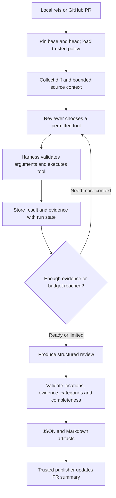

# Undertow — project and learning plan

Planning date: September 30, 2026. This document records the original design and learning roadmap. The current harness is implemented with Java 25 and Spring Boot 4.1.1; its source-analysis target and separate demo remain Java 21. See the [README tech stack](README.md#tech-stack), [implementation status](docs/implementation-status.md) and [migration notes](docs/spring-java25-migration.md) for delivered behavior. Service availability and prices were checked against the official links below on the planning date.

## 1. Recommended concept

Build **Undertow**, a change-risk reviewer that explains **what changed, what could break, what evidence supports that conclusion, and what tests would reduce the risk**. Java is the first supported language; additional languages can be added in later releases.

The distinguishing features are business invariants, Java failure behavior, and evidence-backed dependency migration analysis. Your `CODING-SKILL.md` supplies the engineering policy. A separate business context file supplies facts the agent cannot infer reliably from source code alone.

Project name: **Undertow**. Repository name: `undertow`. Describe it as an agentic change-risk reviewer, with Java support in the initial release.

Example audience: a Java team reviewing a Spring Boot payment or order service. Users can run the tool locally or through GitHub Actions with their own model credentials.

For a portfolio, I would choose this refinement of your idea. It lets you demonstrate Java engineering, agent tool design, evaluation, CI, dependency research, and practical reliability in one understandable workflow. The evidence and measured accuracy matter more than the number of agents.

### Other concepts worth considering

| Concept | Strength | Main difficulty | Recommendation |
|---|---|---|---|
| General Java code reviewer | Easy to explain and demonstrate | Broad scope; substantial overlap with existing tools | Narrow it to change risk |
| Dependency Upgrade Investigator | Clear before/after inputs, migration evidence, compatibility checks, and test plans | Reliable version resolution and documentation retrieval | Best smaller alternative; also a module of this project |
| CI Failure Investigator | Explains failed Java builds using logs, changes, and tests | Logs can be noisy; fixes need execution and validation | Good follow-up project |
| Incident Investigation Assistant | Shows business impact and observability integration | Requires realistic telemetry and more infrastructure | Save for later |

If completion speed is the priority, ship the Dependency Upgrade Investigator first, then expand it into the reviewer.

## 2. First release scope

The first language implementation targets Java 21 source, a single-module Maven application, and a small Spring Boot demo. Support a local base/head comparison first and GitHub PR input second. Keep the shared harness and finding contract independent of the reviewed language.

First release delivers:

- Reviews of changed behavior plus relevant callers, configuration, migrations, and tests.
- A curated rule catalog derived from your guidelines, with stable IDs and section references.
- Dependency change inventory for direct and resolved transitive dependencies when resolution evidence is available.
- Migration research for a small configured set of libraries, rather than claiming universal library support.
- Five risk levels, separate categories and confidence, actionable recommendations, and regression test specifications.
- JSON and Markdown reports, one updated PR summary comment, and a trace of tool calls.
- A reproducible demo and an evaluation dataset containing real bugs and harmless changes.

Defer Gradle, multi-module analysis, additional language implementations, autonomous fixes, executing generated tests, a web dashboard, persistent cross-repository memory, and automatic merging. These are separate milestones, not first-release dependencies. Report unsupported languages explicitly rather than applying Java rules to them.

## 3. Example workflow and demo application

Create a small order/payment service with:

- `OrderService`, a payment gateway adapter, and a repository.
- PostgreSQL-backed orders and a unique idempotency key.
- Monetary values represented with explicit `BigDecimal` rounding rules.
- A short documented contract: one payment per operation key, atomic state transitions, and no successful order when payment is rejected.
- JUnit behavior tests and selected Testcontainers integration tests.

Keep the demo small. It exists to make the reviewer observable and testable, not to become a production payment platform.

Prepare independent before/after fixtures or demonstration PRs:

| Change | What the reviewer should investigate | Regression specification |
|---|---|---|
| Retry a payment write without preserving its idempotency key | Could a lost response cause a second charge? | Simulate accepted payment followed by a dropped response; assert both attempts carry the same key and only one side effect occurs |
| Replace a database uniqueness constraint with `exists()` then `save()` | Can concurrent requests create duplicate operations? | Synchronize two requests at a barrier; assert one committed record and a deliberate duplicate response |
| Call a proxy-based transactional method through `this` | Does the use case lose its intended atomic transaction? | Force failure after the first write through the real Spring service; assert that neither write commits |
| Change money comparison or rounding | Does a supported price produce a different business outcome? | Use explicit decimal strings and boundary amounts; assert documented scale, rounding, and comparison semantics |
| Upgrade a library across a compatibility boundary | Which changed APIs or defaults does this service actually use? | Test the specific serialized payload, HTTP behavior, or configuration affected by the migration |
| Rename a method or safely use a Java record/virtual thread | Is this a harmless improvement permitted by the guidelines? | Reviewer should avoid inventing a risk finding |

These are designed scenarios, not claims about an existing repository or a particular library release.

## 4. Harness, agent, and tools

The **model** proposes investigative steps and conclusions. The **agent** is the model plus its instructions and tool access. The **harness** is our code that controls inputs, tool execution, state, limits, validation, failure handling, and reporting. GitHub Actions runs the harness; it does not replace it.

Use one reviewer agent initially. Dependency research and test planning are workflow stages of that agent. A second opinion or specialist agent is a later experiment, justified only if evaluations show an improvement.



The tool registry should expose narrow operations:

| Tool | Purpose | Boundary |
|---|---|---|
| `get_diff` | Retrieve changed files and hunks at pinned commits | Fixed repository and bounded output |
| `read_source` | Read a selected file range at base or head | Repository-relative paths; reject traversal and symlink escape |
| `find_references` | Find callers, types, annotations, and nearby tests | Dispatch to the language implementation; initially JavaParser; report unresolved symbols |
| `get_rule` | Retrieve relevant trusted guideline sections | No policy replacement by the PR |
| `get_business_context` | Retrieve declared invariants and critical components | Base-branch configuration, identified as owner-provided context |
| `get_ci_evidence` | Read compiler, analyzer, test, and dependency reports | Treat reports as untrusted data and verify provenance |
| `compare_dependencies` | Compare base/head inventories | Use resolved versions when present; mark unresolved versions explicitly |
| `fetch_migration_evidence` | Read official release notes or migration guides | Coordinate-to-source mapping, host allowlist, time/size limits |
| `query_vulnerabilities` | Look up an exact Maven coordinate/version in OSV | Distinguish advisory match from reachable exploitation |
| `compare_library_api` | Inspect compatibility differences between two JARs | Later milestone; fixed tool invocation and artifact source |

Model tools have no unrestricted shell, arbitrary HTTP access, repository write access, or GitHub posting function. Build commands and publishing are deterministic harness/CI operations outside the agent loop.

## 5. Technology choices

The harness uses **Java 25 + Spring Boot 4.1.1 + Maven**. Spring Boot manages the non-web application lifecycle, explicit dependency injection and executable JAR packaging; picocli provides the command-line interface. The review engine remains plain Java. Source analysis currently targets Java 21, and the separate order/payment demo uses Java 21 with Spring Boot 3.4.4. A CLI fits local usage and ephemeral Actions jobs without requiring a hosted server.

| Component | Choice or planned extension | Reason |
|---|---|---|
| Harness runtime/build | Java 25, Spring Boot 4.1.1, Maven | Application lifecycle, explicit wiring, managed dependencies and executable JAR |
| CLI | picocli | Local and CI commands share the same entry point |
| Agent orchestration | Explicit bounded loop and state machine | You can see and test each harness responsibility |
| First model adapter | Official Google Gen AI Java SDK | Hosted free-tier starting route with function calls |
| Review data | Java records, Jackson, JSON Schema validation | Stable machine-readable reports and explicit contracts |
| Java context | JavaParser; symbol solving where classpath evidence permits | Structure and reference lookup beyond plain text |
| Git input | Fixed Git commands through argument arrays | Reuse Git's diff semantics without shell interpolation |
| GitHub input/output | REST API in deterministic adapters | PR metadata and comments do not require an installed app |
| Dependency inventory | Maven dependency reports for both snapshots | Account for resolved versions and transitive dependencies |
| Baseline analysis | Formatter, compiler, SpotBugs, JUnit | Let deterministic tools handle repeatable checks |
| Dependency security | OSV API | Existing advisory evidence rather than model recollection |
| Compatibility extension | japicmp | Source/binary API comparison; runtime behavior still needs tests |
| Demo integration tests | JUnit, AssertJ, Testcontainers | Behavioral assertions against controlled collaborators |
| Observability | Local JSONL events and artifacts | No extra SaaS signup required |

Pin actual dependency and action versions during implementation after compatibility checks. Start with a formatter and SpotBugs; add Checkstyle or Error Prone only where they fill a demonstrated gap. Your guideline lists several valid tools, but using all of them immediately adds setup work and overlapping findings.

The native tool-calling SDK does not decide our authorization or validation policy. Our harness dispatches and validates calls explicitly. A small `ModelClient` boundary allows a future OpenAI adapter or a replay adapter for offline demonstrations. It is not a promise that every provider/model supports identical schemas or tool semantics.

A full agent framework is unnecessary for the initial learning scope. If we later compare an SDK-managed loop with our own, the official OpenAI documentation distinguishes application-owned orchestration from hosted orchestration.

### Adding languages later

Keep diff collection, the agent loop, evidence storage, risk categories, budgets, traces, and publishing in the shared core. Keep source parsing, reference lookup, coding rules, build-report interpretation, dependency ecosystems, and language-specific test guidance in the language implementation.

Start with a concrete Java implementation and small boundaries for language detection and analysis. Do not build a plugin marketplace or a generic abstraction framework before a second language requires it. The proposed `languages/java/` area owns JavaParser, Maven evidence, and your Java rule catalog.

Adding another language means providing its analysis implementation, rule catalog, dependency evidence integration, regression guidance, and labeled evaluation cases. The shared finding schema includes `language`; mixed-language changes are grouped by supported language, while the final risk report can connect evidence across groups. Language support is an evaluated capability, not just an extra prompt.

Sources: [Google Java SDK](https://github.com/googleapis/java-genai), [Gemini function calling](https://ai.google.dev/gemini-api/docs/function-calling), [structured output](https://ai.google.dev/gemini-api/docs/structured-output), [JavaParser](https://github.com/javaparser/javaparser), [picocli](https://picocli.info/), [Maven dependency plugin](https://maven.apache.org/plugins/maven-dependency-plugin/), [SpotBugs Maven integration](https://spotbugs.readthedocs.io/en/stable/maven.html), [OSV API](https://google.github.io/osv.dev/quickstart/), [japicmp](https://github.com/siom79/japicmp), [OpenAI agent runtimes](https://developers.openai.com/api/docs/guides/agents).

## 6. Using your guidelines without turning every preference into a blocker

Preserve `CODING-SKILL.md` as the source document. Build a reviewed catalog that links each selected rule to its section and normative wording. Example IDs:

- `JAVA-TX-001`: transaction proxy self-invocation, section 21.
- `JAVA-DATA-001`: critical uniqueness must be enforced in the database, section 23.
- `JAVA-HTTP-001`: deliberate timeouts, section 24.
- `JAVA-RETRY-001`: safely retryable and idempotent writes, sections 24 and 38.
- `JAVA-MONEY-001`: monetary precision and rounding, section 12.
- `JAVA-LOG-001`: secrets in logs, sections 25 and 36.

Classify rules as deterministic, contextual, or optional guidance. Support the file's legacy exceptions, pragmatism about domain modeling, modern language features, and appropriate virtual-thread usage.

The guideline's `MUST/SHOULD/MAY/AVOID/NEVER` describes policy strength. Its review labels describe engineering urgency. Neither alone determines business impact. Your requested scale is the report's primary risk scale; retain the guideline label as a separate field.

## 7. Risk, category, evidence, and confidence

Use machine values `LOW`, `MEDIUM`, `HIGH`, `CRITICAL`, `HIGH_CRITICAL`, displayed as your requested names. “High Critical” is a project-specific extension above Critical and needs an unusually strict definition.

| Risk | Definition | Example, subject to evidence | Guideline label normally associated |
|---|---|---|---|
| Low | Local quality concern with limited behavioral impact | Unclear naming in an isolated helper | MINOR or SUGGESTION |
| Medium | Credible limited defect or significant maintainability issue | Incorrect handling of a noncritical edge case | MAJOR or MINOR |
| High | Credible production defect affecting an important path | Unbounded upstream waits causing resource exhaustion | MAJOR or BLOCKER |
| Critical | Credible security breach, irreversible integrity failure, or core business outage | Duplicate payment or lost committed order state | BLOCKER |
| High Critical | Evidence-backed widespread/catastrophic impact on a declared critical system | Repeatable systemic corruption across critical tenant records | BLOCKER |

This is a guide, not a mechanical conversion. “High Critical” requires strong technical evidence and owner-declared scope; if scope is unknown, say so and avoid upgrading the risk by speculation. Findings remain review advice requiring human assessment.

Keep category separate: correctness, security, data integrity, concurrency, transactions, reliability, dependency compatibility, API contract, performance, maintainability, or style.

Track confidence as `LOW/MEDIUM/HIGH` with an explanation. Track evidence status as observed, inferred, or unverified. A high-impact hypothesis with low confidence is explicitly an investigation item, not a verified critical finding. CVSS/advisory severity remains its own field.

Do not report existing unrelated problems as new regressions. Include an existing issue only when the change demonstrably activates or worsens it, and describe that relationship.

## 8. Report contract and example

Each finding contains:

`id`, `title`, `language`, `severity`, `category`, `confidence`, `evidence_status`, `guideline_label`, `rule_ids`, pinned commit and location, trigger, changed behavior, technical consequence, business consequence, assumptions, evidence references, recommended change, and regression tests.

Each regression test specifies setup, stimulus, expected outcome, level, and status: **proposed**, **executed/passed**, **executed/failed**, or **not executable here**. Generated example test code is proposed until it actually runs. Never claim a test passed because the model suggested it.

Example output for a deliberately constructed fixture:

> **Finding:** Retried payment loses the operation's idempotency key.  
> **Risk:** Critical. **Category:** Data integrity / reliability.  
> **Confidence:** High if the fixture's gateway contract and adapter confirm this behavior. **Guideline label:** BLOCKER.  
> **Location:** `PaymentGatewayAdapter.charge()` at the reviewed head commit.  
> **Trigger:** Gateway accepts the charge, but its response is lost and the client retries.  
> **Evidence:** The diff removes key reuse; the gateway contract states each new key creates a distinct payment.  
> **Why it matters:** One order may charge the customer twice, violating the declared payment invariant.  
> **Recommended change:** Reuse a stable key across attempts and handle ambiguous payment outcomes deliberately.  
> **Regression:** Simulate a lost first response; assert equal operation keys across attempts and one recorded charge. **Status:** Proposed.

Report metadata includes base/head SHAs, policy/config/prompt versions or hashes, model identity, review coverage, skipped files, unresolved dependencies, tool failures, token usage, elapsed time, and an overall status of complete/partial/failed/skipped.

An empty finding list with partial coverage must not look like a clean review. Preserve analyzer provenance and deduplicate overlapping static/agent findings.

## 9. Dependency version investigation

A major version bump is a trigger for investigation, not proof of a critical change. A patch release can also introduce a relevant behavior change.

For each changed dependency:

1. Identify `groupId:artifactId`, resolved old/new versions, scope, and direct/transitive paths. Resolve Maven properties, parent/BOM management, and profiles using build evidence where available.
2. Compare base and head inventories. If inventory generation failed, distinguish a literal POM change from a verified resolved change.
3. Retrieve official migration guides, release notes, or deprecation documentation for the actual version interval, including intermediate releases.
4. Locate usages in the application. Imports alone are weak evidence; prefer resolved symbols and relevant configuration.
5. Where supported, compare JAR APIs with japicmp. Report source/binary changes separately from runtime behavior, defaults, reflection, and serialization compatibility.
6. Query OSV for the exact versions. Keep vulnerability, deprecated API, removed API, behavior change, unsupported runtime, and end-of-support claims separate.
7. Explain the used feature, affected business flow, migration step, and targeted test.

Every release claim needs a retrieved source reference and version context. Cache source URL, content hash, retrieval time, and the relevant excerpt in evidence storage. If documentation or symbol resolution is missing, say “unverified” or “not resolved”; do not fill the gap from model memory.

First support a small documented source registry, such as Spring/Jackson/HTTP client libraries. Lack of a supported source produces a dependency inventory entry and an explicit coverage gap. It does not silently become “safe.”

## 10. Proposed configuration

The following YAML is a design example, not an implemented interface. Keep trusted configuration and business context on the base branch. Environment variables supply credentials.

```yaml
schema_version: 1
model:
  provider: gemini
  name: gemini-3.1-flash-lite
  api_key_env: GEMINI_API_KEY
  allow_paid_fallback: false
policy:
  business_context: config/business-context.yaml
languages:
  java:
    enabled: true
    version: 21
    policy_source: CODING-SKILL.md
    rule_catalog: config/languages/java/rules.yaml
  unsupported: report
review:
  include: ["**/*.java", "**/pom.xml", "**/*.yml", "**/*.yaml", "**/db/migration/**"]
  exclude: ["**/target/**", "**/generated/**", "**/vendor/**"]
  report_excluded_and_truncated: true
limits:
  max_model_calls: 12
  max_tool_calls: 30
  max_context_tokens: 30000
  max_total_tokens: 80000
  run_timeout_seconds: 300
  tool_timeout_seconds: 20
  retry_attempts: 2
dependencies:
  source_registry: config/dependency-sources.yaml
  osv_enabled: true
output:
  formats: [json, markdown]
  max_findings: 10
  update_single_pr_comment: true
ci:
  agent_mode: advisory
  block_on_agent_findings: false
```

Limits are starting proposals to tune through measurements. Provider token accounting and enforcement capabilities vary; reserve output capacity before calls and stop conservatively near the application budget. Do not present an application estimate as a guaranteed billing cap.

Business context example:

```yaml
service: order-payments
critical_components: [OrderService, PaymentGatewayAdapter]
invariants:
  - id: PAYMENT-ONE-CHARGE
    statement: An operation key may create at most one payment.
  - id: ORDER-ATOMIC-STATE
    statement: A failed placement must not leave a successful order record.
impact_context:
  payment_failure: Customer funds and reconciliation are affected.
```

## 11. GitHub Actions and pipeline checks

Include deterministic pipeline checks in the project. They are complementary to the agent and valuable learning material. We do not need to postpone them as a separate project.

Use separate execution boundaries:

**A. Ordinary PR CI:** compile, verify formatting, run SpotBugs, run unit/integration tests, and collect dependency inventories in ephemeral runners with no model API secret. Fork builds use read-only permissions. Maven plugins, wrappers, tests, and dependencies may execute code, so even `dependency:tree` belongs in this unprivileged stage.

**B. Agent review:** initially a maintainer-triggered `workflow_dispatch` using the trusted default-branch workflow and a pinned harness artifact. Accept a validated PR number, capture its base/head, and read source as data. Never import, build, or run the PR's harness/scripts in this job. Use only the model credential and necessary read permissions.

**C. Publisher:** after deterministic schema/evidence validation, a trusted step/job with only the necessary PR write permission updates one marked summary comment. It verifies repository, PR, head SHA, report provenance, and allowed locations. Render untrusted strings safely. If head changed while reviewing, mark the result stale and do not publish it as current.

Validate artifact sizes, paths, JSON/XML schemas, originating workflow/run/commit, and all external identifiers. Do not execute artifacts, extract arbitrary archives, or trust a finding's requested action. Separate trusted harness caches from untrusted build caches. Pass user data through structured arguments, not shell script interpolation.

For the initial public repository, forks get normal CI automatically and agent review on maintainer request. This makes model spending and source submission deliberate. Automatic AI reviews can follow once this boundary is proven. Restrict automatic runs even for same-repository branches unless their authors and workflow changes are trusted.

GitHub documents that fork PR workflows generally lack repository secrets and receive restricted tokens. Avoid a `pull_request_target` design that executes PR code with secrets. [GitHub secure workflow guidance](https://docs.github.com/en/actions/reference/security/secure-use).

Keep agent findings advisory initially. Deterministic checks may block normally. Optional agent gating is a later feature, with measured precision, explicit failure policy, a human override, and clear handling of partial reviews.

## 12. Reliability, state, and observability

- Tool arguments and final outputs are schema-validated; unknown tools are rejected.
- Source comments, PR descriptions, release notes, and artifacts are untrusted evidence, never authority to change policy or permissions.
- Repository access is bounded to pinned snapshots. HTTP retrieval blocks internal/private addresses, disallowed redirects, and hosts outside the trusted source registry.
- State contains observations and evidence, not unfiltered tool output forever. Keep enough context to preserve counterevidence and open questions when summarizing.
- Retry only transient errors with bounded backoff; stop on authentication failure. On quota exhaustion, generate a partial report without silently switching to paid execution.
- Evidence/output validation gets one bounded repair attempt. Invalid results fail visibly instead of being published.
- Cache deterministic analysis by commit/config/tool version and documentation by source/version. Reuse only when provenance matches.
- Trace run ID, stage, tool name, sanitized arguments, duration, outcome, provider token usage, and evidence IDs. Avoid secrets and default raw-source/prompt logging.
- Store a replayable evidence bundle and fake model responses for deterministic offline demos/tests. This reproduces harness behavior, not a guarantee of identical future live-model conclusions.

Expose artifacts locally first. Later, OpenTelemetry or a trace viewer can improve exploration without becoming a signup prerequisite. Store observable decisions and tool activity; do not depend on hidden model reasoning.

## 13. Evaluation: prove useful behavior

Create at least 25 small labeled change cases, with paired unsafe and corrected examples where useful. Include money, transactions, concurrency, retries, dependency changes, benign refactors, and modern Java features.

Evaluate three baselines on the same held-out cases:

1. Deterministic tools only.
2. One model response given the diff and guidelines.
3. Tool-using reviewer with targeted context and retrieved evidence.

Use rule/behavior expectations and evidence checks rather than matching exact model wording. Keep tuning cases separate from held-out evaluation cases. Record model/prompt versions and report repeated-run variability.

Proposed first-release targets, not measured promises:

- At least 80% precision on reported High/Critical findings in the held-out sample.
- At least 70% recall for the supported, labeled high-impact cases.
- Every published finding has a valid location and evidence reference.
- No invented library migration claims in the dependency fixtures.
- Harmless changes remain mostly quiet; track false-positive rate separately.
- Report cost, latency, tool calls, severity disagreement, and regression-test usefulness.

Also test harness behavior under malformed model JSON, missing documentation, unavailable OSV, quota exhaustion, timeouts, stale heads, prompt injection, path traversal, and duplicate runs. A second model can help grade explanations, but cannot replace curated labels and human review.

## 14. Build milestones and learning outcomes

Estimate: 4–6 weeks of part-time work for the defined release, depending on familiarity and scope. Dependency resolution and safe GitHub publishing are likely the slowest parts.

| Milestone | Deliverable / completion check | What you learn |
|---|---|---|
| 0. Setup and contracts | Accounts ready; scope, rule catalog, finding schema, and 5 demo cases agreed | Turn product goals into agent contracts |
| 1. Deterministic collector | Local base/head diff, source index, policy loading, JSON report skeleton | Context gathering, parsing, provenance |
| 2. First agent loop | Tools selected by the model; validated dispatch; one end-to-end local report | Function calls, state, budgets, termination |
| 3. Risk and regression reasoning | Business context, evidence checks, severity rubric, proposed tests | Grounding claims and calibrated uncertainty |
| 4. Dependency investigator | Resolved comparison and cited migration investigation for supported libraries | Research tools and compatibility analysis |
| 5. GitHub integration | Unprivileged CI, maintainer review workflow, idempotent summary publishing | Permissions, trust boundaries, lifecycle |
| 6. Evaluation and resilience | Held-out comparison report and failure-path checks | Measure value beyond a prompt demo |
| 7. Public release | Quickstart, packaged CLI/action, demo evidence, architecture explanation | Make the project usable and reviewable |

If milestone 4 grows too large, ship code/behavior review with a clearly documented dependency inventory feature, then add migration research as the next release. Do not advertise unfinished checks as supported.

## 15. Proposed repository structure

```text
CODING-SKILL.md                 # Your preserved source policy
README.md
pom.xml
src/main/java/.../
  cli/
  harness/                     # Loop, state, budgets, termination
  model/                       # Gemini adapter and replay adapter
  tools/                       # Bounded reads, indexes, evidence retrieval
  languages/java/              # Java analysis and Maven evidence adapters
  policy/
  findings/
  reporting/
  github/
src/test/java/.../
config/
  review.yaml
  languages/java/rules.yaml
  business-context.yaml
  dependency-sources.yaml
demo/order-service/
evals/cases/
evals/expected/
docs/
  architecture.md
  tool-contracts.md
  learning-journal.md
  evaluation-report.md
  sample-review.md
.github/workflows/
  ci.yml
  agent-review.yml
```

This is a proposed layout, not files already implemented. Start as one harness module; split modules only when a concrete boundary benefits from it.

## 16. Accounts, costs, and signup checklist

| Service/tool | Needed before development? | Setup and cost |
|---|---|---|
| GitHub | Yes for the hosted demo; local prototype can start without it | Use an existing account or create a free one; create a public repo when ready. Standard hosted Actions runners are free for public repositories; larger runners/storage have separate billing rules |
| Google AI Studio / Gemini API | Yes before a live hosted-model run | Use a Google account, create/select a project and API key, confirm free-tier model availability/quota. `gemini-3.1-flash-lite` is the test/demo starting model currently listed with free standard input/output |
| OSV | No signup in the documented public query flow | Public API for known vulnerability evidence; respect service limits |
| JDK 25 for the harness; JDK 21 for the demo; Maven and analysis libraries | No online account | Local tools/dependencies; use the matching toolchain for each module |
| Container runtime | Needed by the demo's container-based integration tests | Use a runtime suitable for your machine; no container SaaS needed |
| OpenAI API | Optional later comparison | Separate adapter and account-specific billing; not required for the free Gemini route |
| Trace hosting, vector database, cloud server | No | Local traces and Actions artifacts cover this scope |

**Recommended initial route: GitHub + Google AI Studio, with free-tier usage and no automatic paid fallback.** No expiring trial is required by this design. Exact quota and model access depend on the account; verify them in AI Studio before live runs. Google's pricing page states free-tier content may be used to improve products, so this route fits the public demo code. Choose a suitable paid/private-data arrangement separately before using proprietary code.

Sources: [GitHub Actions billing](https://docs.github.com/en/billing/concepts/product-billing/github-actions), [Gemini pricing](https://ai.google.dev/gemini-api/docs/pricing), [Gemini key setup](https://ai.google.dev/gemini-api/docs/api-key), [OSV quickstart](https://google.github.io/osv.dev/quickstart/).

Preparation steps:

1. Ensure your GitHub account is ready. We can create or initialize the repository as part of a later development request.
2. Open [Google AI Studio](https://aistudio.google.com/) and create a Gemini API key in a project with the intended free-tier access.
3. Keep the key locally in `GEMINI_API_KEY`, and later add it to the trusted review workflow's GitHub secret/environment. Do not paste it into the chat or commit it.
4. Confirm that the selected model permits a small tool-calling request in your account; a different available free-tier model can be configured if necessary.
5. Decide whether the scope should be the full reviewer or the smaller dependency investigator. The full reviewer is the recommendation for this plan.

Target cash cost is $0 while within the available free quotas and public standard-runner use. This is not unlimited inference or a promised permanent provider offer. Development begins only after you ask to proceed; this document completes the planning request.

## 17. Making it a useful GitHub portfolio project

The README should show a sample PR review near the top, followed by a short local command, setup, supported scope, and known limitations. Add:

- An architecture diagram explaining the harness and its permission boundaries.
- A short screencast showing an investigation, retrieved evidence, and a useful regression test.
- A measured comparison against static tools and a diff-only prompt.
- A learning journal covering decisions about context, tools, severity, retries, and publishing.
- Several fixed and buggy demo PRs, including harmless changes that receive no alarming findings.
- A packaged release and reusable GitHub Action accepting users' own credentials.
- An appropriate open-source license, contribution guide, and documented data handling.

A future resume description should name the implemented capabilities and measured results. Do not claim production reliability or detection percentages until the evaluation supports them.
