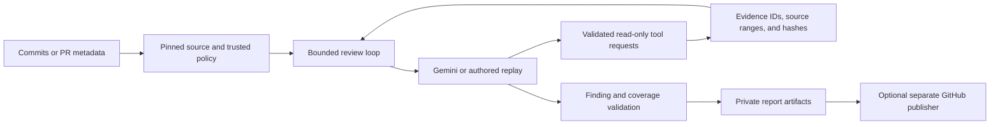

<p align="center">
  
</p>

# Undertow

**Understand the risk behind a Java change.**

Undertow reviews pinned Git changes and explains what could break, the conditions that trigger it, the technical and business consequences, and the evidence behind each finding. It combines a bounded Gemini investigation loop with repository-owned rules, read-only tools, and validated reports.

Use it to investigate payment retries, transaction boundaries, tenant isolation, monetary calculations, secret logging, timeouts, and dependency changes. Findings are advisory; proposed regression tests are specifications for a developer to implement and run.

**Current scope:** Java 21 source in single-module Maven projects. The harness builds and runs with JDK 25. A GitHub Actions integration is available, and the Phase 3 central service is an internal implementation with outstanding deployment and live-pilot gates. Live-model accuracy is not yet established.

[Quick start](#quick-start) · [Live review](#run-a-live-review) · [GitHub](#github-integration) · [Hosted service](#hosted-service-preview) · [Security](SECURITY.md) · [Contributing](CONTRIBUTING.md)

## What a finding looks like

> **Retried payment loses its operation key**
>
> **Risk: Critical · Category: Data integrity · Confidence: High**
>
> **Trigger:** The gateway accepts a payment, loses the response, and the caller retries.
>
> **Consequence:** Generating a fresh key for every attempt can charge the customer twice.
>
> **Recommendation:** Reuse the operation key across attempts.
>
> **Proposed regression:** Drop the first response; assert identical keys and one charge.

This is a synthetic, authored example. It demonstrates the report structure, not measured live-model detection. See the [sample review](docs/sample-review.md), [evidence](docs/sample-evidence.json), and [offline terminal recording](docs/demo.cast).

## Quick start

Requirements: **JDK 25**, **Maven 3.9+**, **Git**, and **Python 3**. Run these commands from the repository root. The offline example needs no API key, GitHub account, or Docker.

```sh
java -version
mvn -version
mvn verify

python3 scripts/prepare-demo.py --output .undertow/demo
java -jar target/undertow.jar review \
  --repo .undertow/demo --base HEAD~1 --head HEAD \
  --replay .undertow/demo/replay.json \
  --output .undertow/demo-review
```

Open `.undertow/demo-review/report.md`. A `partial` result is expected when CI, classpath analysis, or explicit rule assessments are missing. Zero findings in an incomplete report is not a safety verdict.

Replay feeds authored responses through the real tool dispatch, evidence validation, and reporting pipeline. It does not call Gemini or measure model accuracy. Use a new demo destination for each run; preparation preserves existing evidence.

For a ten-scenario tour, or all 40 scenarios:

```sh
python3 scripts/showcase.py --output .undertow/showcase
python3 scripts/showcase.py --all --output .undertow/showcase-all
```

Open the generated `index.md`. The [showcase guide](docs/client-showcase.md) explains the unsafe/corrected pairs, benign controls, and evaluation commands.

## How it works



The model requests investigations; Undertow owns tool permissions, budgets, deadlines, and final validation. Nine tools cover diffs, source reads, syntactic references, rules, business context, CI evidence, Maven dependencies, registered migration sources, and exact-version OSV queries. Reviewed source is read as Git objects; it is never built or executed in the review loop.

Each finding must reference diff evidence and source evidence covering its pinned location. Reports separate risk, confidence, evidence status, guideline strength, and rule coverage. Schema and provenance checks make findings traceable; they do not prove every model conclusion correct.

Local policy defaults to the trusted base commit. The GitHub integration separates the analysis merge base from the current target tip and target policy. Head-side rule changes cannot silently suppress the current review. See [architecture](docs/architecture.md) and [tool contracts](docs/tool-contracts.md).

## Run a live review

The example configuration names `gemini-3.1-flash-lite` and reads `GEMINI_API_KEY`. Verify model access for your account through [Google AI Studio](https://aistudio.google.com/). Provide the key through a secret manager or a hidden terminal prompt. Do not put it in source, command arguments, committed environment files, screenshots, or issues. Undertow reads the process environment; it does not load `.env` files automatically.

First test access without sending repository source:

```sh
java -jar target/undertow.jar doctor \
  --repo .undertow/demo --base HEAD~1 --head HEAD --network
```

Then review the synthetic payment change using real model responses:

```sh
java -jar target/undertow.jar review \
  --repo .undertow/demo --base HEAD~1 --head HEAD \
  --mode tools --output .undertow/live-review
```

Omitting `--replay` selects the live client in `tools` and `diff` modes. Live reviews send bounded source and evidence to Google and may incur charges. There is no automatic model/provider or paid fallback. Application token limits are not guaranteed provider billing caps.

For your own repository, commit trusted `CODING-SKILL.md` and `config/` files to its base branch and adapt the business invariants:

```sh
java -jar target/undertow.jar rules validate --repo /path/to/repo --base main
java -jar target/undertow.jar review \
  --repo /path/to/repo --base main --head feature \
  --output .undertow/my-review
```

| Mode | Behavior | Gemini requests |
|---|---|---|
| `tools` | Investigates through permitted tools; default review mode | Yes, unless `--replay` is supplied |
| `diff` | Diff-and-guidelines baseline with source content withheld | Yes, unless `--replay` is supplied |
| `collect` | Deterministic diff collection without semantic risk review | No |
| `--replay FILE` | Authored model responses for reproducible demonstrations | No |

Authentication, quota, model access, timeouts, and invalid output remain visible in retained reports. An `authentication` failure means the configured credential was not accepted; repeating a failed review does not establish code safety. See the [setup and troubleshooting guide](docs/phase2-setup.md).

## Reports and commands

| Artifact | Purpose |
|---|---|
| `report.md` | Human-readable findings, consequences, proposed tests, and coverage gaps |
| `report.json` | Versioned structured report, identities, usage, and failure cause |
| `evidence.json` | Retrieved evidence, pinned locations, hashes, and provenance |
| `trace.jsonl` | Sanitized model/tool events and usage records |
| `publication.json` | Independent GitHub publication outcome and receipt |

Artifacts can contain source and private information. Keep them in ignored local directories or access-controlled CI/service storage. Do not attach private evidence to public issues.

Exit `0` means artifacts were produced, including partial or skipped outcomes. Exit `2` means final-output validation failed. Setup errors exit nonzero. Automation must inspect `status`, `coverage_gaps`, and `details.failure_cause` in `report.json`.

| Command | Purpose |
|---|---|
| `review` | Review pinned local source changes |
| `doctor` | Check setup; `--network` explicitly tests Gemini access |
| `rules validate/list/explain` | Validate and inspect trusted rules |
| `investigate-dependency` | Collect dependency inventory, official notes, and OSV evidence without a model |
| `pr-info` | Capture current GitHub PR metadata |
| `publish` / `mark-stale` | Publish an owned bot summary or invalidate an outdated one |
| `service` | Start the internal central control API |
| `service-worker` / `service-publisher` | Run separately credentialed review and publication processes |

Run `java -jar target/undertow.jar COMMAND --help` for options. Rule schemas support company-owned rules, applicability, references, examples, and expiring scoped exceptions. See the [rule guide](docs/phase2-setup.md#rules-and-trusted-policy-p2-04).

## GitHub integration

The included [agent review workflow](.github/workflows/agent-review.yml) supports maintainer dispatch and administrator opt-in automatic reviews of trusted internal, non-draft PRs. The administrator variable `UNDERTOW_AUTO_REVIEW=true` enables automatic operation; supply `GEMINI_API_KEY` as a repository secret.

The workflow builds trusted default-branch source, reads PR Git objects as data, and separates model access from publication. Publication validates artifact provenance, numeric bot ownership, and current head/target commits. Serialized runs update one owned summary; outdated results are rejected or marked stale. Ordinary build/test CI remains independent of AI outcomes.

The reusable [action](action.yml) produces review artifacts. Publication is a separate step. Pin distributed actions by full commit SHA. Follow the [GitHub setup guide](docs/phase2-setup.md#githubcom-workflow-p2-02) for permissions, trusted CI imports, fork/draft handling, and rollback.

## Hosted service preview

Phase 3 wraps the engine in a central service with GitHub OAuth/App integration, tenant-scoped encrypted state, durable jobs and leases, immutable rule packages, integer credit reservations and settlement, private artifacts, and a same-origin administration interface. Workers and publishers have separate credentials and permissions.

Try the packaged worker without credentials:

```sh
python3 scripts/phase3-demo.py --output .undertow/hosted-demo
```

The [customer-only application](demo/customer-service/README.md) contains application code, ordinary CI, and `.undertow/` company rules; it has no engine dependency or model credential.

**Phase 3 P0 is not complete.** A real deployment needs a registered App, protected credentials, HTTPS, enforced worker isolation, operational supervision, and live pilot evidence. The example configuration deliberately disables live execution and supplies no runner commands. See [service setup](docs/phase3-setup.md) and [delivery status](docs/phase3-status.md).

## Tech stack

| Area | Technology |
|---|---|
| Harness | Java 25, Spring Boot 4.1.1, Maven, picocli |
| Source analysis | JavaParser configured for Java 21 syntax |
| Model integration | Official Google Gen AI Java SDK; authored replay adapter |
| Contracts | Jackson JSON/YAML and JSON Schema validation |
| Internal service state | Embedded H2 with identity-bound AES-256-GCM record encryption |
| Quality checks | JUnit Jupiter, AssertJ, Spotless, SpotBugs |
| Order/payment demo | Java 21, Spring Boot 3.4.4, PostgreSQL, Flyway, Testcontainers |

## Verification and evaluation

```sh
# JDK 25: harness tests, formatting, and static analysis
mvn verify
python3 -m unittest discover -s scripts/tests -v
python3 scripts/public-check.py

# Authored corpus evaluation across collect, diff, and tools
python3 scripts/evaluate.py --split all --output .undertow/eval-replay

# JDK 21 or newer: independent customer-application tests
mvn -f demo/customer-service/pom.xml verify
```

The corpus contains 40 synthetic cases: ten tuning inputs and thirty held out. Authored replay scores validate the harness; they are not live-model precision or recall. Live evaluation and human feedback procedures are documented in the [evaluation guide](docs/phase2-setup.md#evaluation-and-feedback-p2-01-p2-07).

The separate executable [order/payment service](demo/order-service/README.md) uses JDK 21. Run `mvn -f demo/order-service/pom.xml test` for controlled behavior tests, or `verify` with Docker for PostgreSQL integration tests. Interactive use requires an explicitly supplied `DATABASE_PASSWORD`. Restore JDK 25 before running the harness.

## Limitations and project status

- Analysis is syntactic. Receiver, overload, and classpath symbol resolution remain unresolved.
- Gradle, multi-module builds, additional languages, and native GitLab/Bitbucket adapters are deferred.
- Parent/BOM/profile resolution needs imported build evidence; literal POM comparisons cannot establish the full dependency graph.
- Migration notes and vulnerability matches do not prove complete compatibility or reachable exploitation.
- Autonomous fixes, generated-test execution, cross-repository memory, and AI merge gating are not implemented.
- Live-model quality and external pilot acceptance remain unverified.

[Phase 2 status](docs/phase2-status.md) · [Phase 3 status](docs/phase3-status.md) · [Evaluation status](docs/evaluation-report.md) · [Implementation status](docs/implementation-status.md)

## Contributing and security

Keep committed content and commit messages in English. Use synthetic examples and protect credentials outside Git. See [CONTRIBUTING.md](CONTRIBUTING.md) for development checks and [SECURITY.md](SECURITY.md) for source handling, secret scanning, and publication precautions.

Licensed under [MIT](LICENSE).
