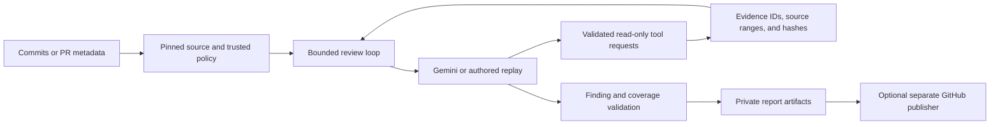

<p align="center">
  
</p>

# Undertow

**Understand the risk behind a Java change.**

Undertow reviews pinned Git changes and explains what could break, the conditions that trigger it, the technical and business consequences, and the evidence behind each finding. It combines a bounded Gemini investigation loop with repository-owned rules, read-only tools, and validated reports.

Use it to investigate payment retries, transaction boundaries, tenant isolation, monetary calculations, secret logging, timeouts, and dependency changes. Findings are advisory; proposed regression tests are specifications for a developer to implement and run.

**Current scope:** Java 21 source in single-module Maven projects. The harness builds and runs with JDK 25. A GitHub Actions integration is available, and the Phase 3 central service is an internal implementation with outstanding deployment and live-pilot gates. Live-model accuracy is not yet established.

[Choose a path](#choose-your-starting-point) · [Quick start](#quick-start) · [Your repository](#review-your-own-repository) · [GitHub](#github-integration) · [Dependencies](#investigate-a-dependency-change) · [Hosted service](#hosted-service-preview)

## What a finding looks like

> **Retried payment loses its operation key**
>
> **Risk: Critical · Category: Data integrity · Confidence: High**
>
> **Trigger:** The gateway accepts a payment, loses the response, and the caller retries.
>
> **Consequence:** Generating a fresh key for every attempt can charge the customer twice.
>
> **Recommendation:** Reuse the operation key across attempts.
>
> **Proposed regression:** Drop the first response; assert identical keys and one charge.

This is a synthetic, authored example. It demonstrates the report structure, not measured live-model detection. See the [sample review](docs/sample-review.md), [evidence](docs/sample-evidence.json), and [offline terminal recording](docs/demo.cast).

## Choose your starting point

| Your goal | Path | What you need | What you get |
|---|---|---|---|
| Try Undertow without credentials | [Offline quick start](#quick-start) | Local build tools | An authored replay report with evidence and coverage gaps |
| Review a change in your own repository | [Local CLI](#review-your-own-repository) | Trusted policy files and a Gemini key | A live review of two committed Git snapshots |
| Review GitHub PRs in CI | [GitHub Actions](#github-integration) | Trusted workflow/action, repository policy, Gemini secret, and GitHub permissions | Review artifacts and optional bot summary publication |
| Research a dependency upgrade without a model | [Dependency investigation](#investigate-a-dependency-change) | Repository policy, a committed dependency change, and network access | Literal POM inventory, registered migration notes, and OSV evidence |
| Explore central management for multiple repositories and tenants | [Hosted service preview](#hosted-service-preview) | Local tools for the worker demo; operator setup and a GitHub App for the service | An internal service implementation with private reports, rules, usage, and feedback |

Start with the offline quick start if you are evaluating the tool. For application adoption, continue with the local CLI or GitHub Actions. The central service still has outstanding deployment and live-pilot gates.

CLI, Actions, and the central service are ways to run Undertow. `tools`, `diff`, and `collect` are [review modes](#review-modes); `--replay` supplies authored responses for offline runs.

## Quick start

Requirements: **JDK 25**, **Maven 3.9+**, **Git**, and **Python 3**. The offline example needs no API key, GitHub account, or Docker. The first Maven build needs access to dependency repositories.

Clone the project, or start in the repository root if you already have a checkout:

```sh
git clone https://github.com/alpercandemir/undertow.git
cd undertow
```

Build the executable JAR and generate your first report:

```sh
java -version
mvn -version
mvn verify

python3 scripts/prepare-demo.py --output .undertow/demo
java -jar target/undertow.jar review \
  --repo .undertow/demo --base HEAD~1 --head HEAD \
  --replay .undertow/demo/replay.json \
  --output .undertow/demo-review
```

Open `.undertow/demo-review/report.md`. The default fixture demonstrates a retry-key defect; its authored report contains one finding. A `partial` result is expected when CI, classpath analysis, or explicit rule assessments are missing. Zero findings in an incomplete report is not a safety verdict. The same directory also contains the [structured report and evidence](#reports-and-commands).

Replay feeds authored responses through the real tool dispatch, evidence validation, and reporting pipeline. It does not call Gemini or measure model accuracy. Use a new demo destination for each run; preparation preserves existing evidence.

For a ten-scenario tour, or all 40 scenarios:

```sh
python3 scripts/showcase.py --output .undertow/showcase
python3 scripts/showcase.py --all --output .undertow/showcase-all
```

Open the generated `index.md`. The [showcase guide](docs/client-showcase.md) explains the unsafe/corrected pairs, benign controls, and evaluation commands.

## Run a live review

After the quick start, you can review the same synthetic change with Gemini. These commands assume `.undertow/demo` and `target/undertow.jar` already exist.

The example configuration names `gemini-3.1-flash-lite` and reads `GEMINI_API_KEY`. Verify model access for your account through [Google AI Studio](https://aistudio.google.com/). Provide the key through a secret manager or a hidden terminal prompt. Do not put it in source, command arguments, committed environment files, screenshots, or issues. Undertow reads the process environment; it does not load `.env` files automatically.

First test access without sending repository source:

```sh
java -jar target/undertow.jar doctor \
  --repo .undertow/demo --base HEAD~1 --head HEAD --network
```

Then review the synthetic payment change using real model responses:

```sh
java -jar target/undertow.jar review \
  --repo .undertow/demo --base HEAD~1 --head HEAD \
  --mode tools --output .undertow/live-review
```

Omitting `--replay` selects the live client in `tools` and `diff` modes. Live reviews send bounded source and evidence to Google and may incur charges. There is no automatic model/provider or paid fallback. Application token limits are not guaranteed provider billing caps.

Open `.undertow/live-review/report.md` and inspect its findings and coverage gaps. A successful model-access check does not guarantee a complete review.

Authentication, quota, model access, timeouts, and invalid output remain visible in retained reports. An `authentication` failure means the configured credential was not accepted; repeating a failed review does not establish code safety. See the [setup and troubleshooting guide](docs/phase2-setup.md).

## Review your own repository

Use this path for a local Java 21, single-module Maven application. Build Undertow once using the quick start; the application does not need an Undertow Maven dependency. Run the commands below from the Undertow checkout, replacing `/path/to/repo`, `main`, and `feature` with your application repository and committed refs.

1. Copy the following policy files from this project into the same relative paths in your application repository. Preserve any existing company policy and merge the templates as needed.
2. Adapt the guidelines, rule applicability, examples, and business invariants to the application. Set the model and execution limits in `config/review.yaml`; register official dependency sources in `config/dependency-sources.yaml`.
3. Commit the policy to the trusted base branch before reviewing a feature. Undertow reads policy and source from Git commits, so uncommitted edits are not included. Policy added only on the feature branch is not used by the default review.

```text
your-application/
  CODING-SKILL.md
  config/
    review.yaml
    business-context.yaml
    dependency-sources.yaml
    languages/
      java/
        rules.yaml
```

All five files are required for local CLI policy loading. Commit any repository files referenced by your rules as well. `config/spotbugs-exclude.xml` belongs to this project's build and is not required for application policy.

Validate the committed rules and check model access using the credential setup in [Run a live review](#run-a-live-review):

```sh
java -jar target/undertow.jar rules validate --repo /path/to/repo --base main
java -jar target/undertow.jar doctor \
  --repo /path/to/repo --base main --head feature --network
java -jar target/undertow.jar review \
  --repo /path/to/repo --base main --head feature \
  --mode tools --output .undertow/my-review
```

Open `.undertow/my-review/report.md` in the Undertow checkout. Here `main` is both the comparison baseline and trusted policy source. For a PR-style comparison starting at a merge base, set `--base` to that commit and supply the current target commit through both `--policy-commit` and `--target-head`; the [GitHub adapter](#github-integration) prepares those identities.

### Customize rules and limits

Use `rules list --repo /path/to/repo --base main` to discover rule IDs, and `rules explain RULE_ID --repo /path/to/repo --base main` to inspect one. Company-owned rules support path/language applicability, repository references, unsafe/corrected examples, and expiring scoped exceptions. The [rule guide](docs/phase2-setup.md#rules-and-trusted-policy-p2-04) includes a tenant-isolation example and candidate-policy validation.

In `config/review.yaml`, `model` selects the Gemini model and credential environment name; `limits` bounds model/tool calls, context/total tokens, deadlines, and retries; `output.max_findings` bounds findings. Local reviews use the values committed at the trusted policy ref. These application limits do not guarantee a provider billing cap.

### Review modes

| Mode | Behavior | Gemini requests |
|---|---|---|
| `tools` | Investigates through permitted tools; default review mode | Yes, unless `--replay` is supplied |
| `diff` | Diff-and-guidelines baseline without additional source reads or tool investigation | Yes, unless `--replay` is supplied |
| `collect` | Deterministic diff collection without semantic risk review | No |

Choose a mode with `review --mode tools|diff|collect`. For reproducible offline demonstrations in `tools` or `diff`, add a compatible `--replay FILE`; replay is a response source, not a fourth review mode. `diff` still sends changed code in the diff to Gemini.

### Include existing CI evidence

Undertow can incorporate already-produced JUnit results, SpotBugs findings, and Maven dependency trees. Tests that ran in CI and model-proposed regression tests appear separately in reports; the reviewer does not execute either the application or proposed tests.

Use the [CI evidence guide](docs/phase2-setup.md#ci-evidence-p2-05) to import an administrator-approved GitHub workflow/run for the exact reviewed head. Pass its bundle and trusted importer receipt through `--ci-bundle` and `--ci-receipt`. Missing or unverified evidence stays visible as a coverage gap; a local bundle alone cannot establish verified test success.

## GitHub integration

Choose the integration that matches your repository:

| Integration | Use it for | Setup boundary |
|---|---|---|
| Included [agent review workflow](.github/workflows/agent-review.yml) | Running the full review/publication flow in this Undertow repository or a fork containing its engine and scripts | Builds the trusted default-branch harness and uses this repository's helper scripts |
| Reusable [action](action.yml) | Adding review artifact generation to a separate application repository | Builds its own pinned harness; your trusted workflow prepares source snapshots and handles artifact upload/publication |
| [Central service](#hosted-service-preview) | Keeping the engine and model credentials out of customer repositories | Requires operator deployment and a registered App; currently an internal preview |

### Try the included workflow

1. Keep the engine, helper scripts, workflow, and policy on the trusted default branch. Configure `GEMINI_API_KEY` as a repository Actions secret.
2. In **Actions → Undertow agent review → Run workflow**, select the default branch, enter a PR number, keep `replay_case: live`, and leave `publish` disabled for your first run. Maintainer authorization is checked at runtime. Authored replay cases are available for demonstrations.
3. Download the `trusted-review` artifact and inspect `report.md` and `report.json`. Enable `publish` on a subsequent dispatch to create or update the bot summary; inspect the separate `publication-receipt` artifact for its outcome.
4. To enable automatic review/publication of trusted internal, non-draft PRs, set the administrator-controlled repository variable `UNDERTOW_AUTO_REVIEW=true`. Fork/external and draft reviews require maintainer dispatch. Set the variable to `false` to return to manual operation.

The workflow builds trusted default-branch source, reads PR Git objects as data, and separates model access from publication. Publication validates artifact provenance, numeric bot ownership, and current head/target commits. Serialized runs update one owned summary; outdated results are rejected or marked stale. Ordinary build/test CI remains independent of AI outcomes.

### Adopt it in a separate application repository

First commit the [local policy files](#review-your-own-repository) to the application's trusted target branch. The included workflow depends on Undertow's engine and scripts, so copying only its YAML into an application repository is insufficient.

Build a trusted workflow around the reusable action:

1. Authorize the trigger and fetch PR metadata and source as Git objects using the trusted `pr-info` command and `scripts/github-snapshots.py`. Obtain these helpers from the same pinned Undertow checkout. Retain the analysis merge base, current target tip, policy commit, and reviewed head.
2. Invoke `alpercandemir/undertow@FULL_COMMIT_SHA`, replacing the placeholder with a reviewed full commit SHA. Supply `repository-path`, `base`, `head`, `policy-commit`, `target-head`, `api-key` from an Actions secret, and `output-directory`. Optional CI inputs are `ci-bundle` and `ci-receipt`.
3. Upload the generated report/evidence/trace/publication files with access and retention appropriate for source-bearing artifacts. The action produces files in `output-directory`; it does not upload artifacts or post a PR comment.
4. If you want a bot summary, add a separate serialized publication job with PR write permissions and validated artifact provenance, following the included workflow. Keep the model step separate from the publication credential and use trusted action/helper definitions.

The [GitHub setup guide](docs/phase2-setup.md#githubcom-workflow-p2-02-p2-06) covers permissions, private Git fetch, trusted CI imports, fork/draft handling, publication recovery, and rollback. With the included workflow, optional CI import requires `UNDERTOW_CI_WORKFLOW_ID` and the manual dispatch's `ci_run_id`.

## Investigate a dependency change

Use `investigate-dependency` when you want upgrade evidence without Gemini. It compares literal POM inventories, fetches registered official notes for the selected versions, and queries OSV for the new version. It makes network requests, requires the same local policy files, and needs no model key.

After building the JAR, prepare the bundled Jackson upgrade fixture:

```sh
python3 scripts/prepare-demo.py \
  --case dependency-major-inventory --output .undertow/dependency-demo
java -jar target/undertow.jar investigate-dependency \
  --repo .undertow/dependency-demo --base HEAD~1 --head HEAD \
  --coordinate com.fasterxml.jackson.core:jackson-databind \
  --old-version 2.18.3 --new-version 3.0.0 \
  --output .undertow/dependency-investigation.json
```

Open `.undertow/dependency-investigation.json` for inventory, retrieved notes/advisories, and failures. For your own repository, replace the refs, coordinate, and versions with an actual committed dependency change. Migration sources must be registered in trusted `config/dependency-sources.yaml`; arbitrary URLs are not accepted.

This command produces evidence rather than a semantic review report and declares partial coverage even when retrieval succeeds. Missing notes or advisories remain explicit failures. It does not establish full dependency resolution, API/runtime compatibility, or reachable exploitation. Use `review --mode tools` to investigate dependency evidence as part of a broader model review.

## Hosted service preview

Phase 3 wraps the engine in a central service with GitHub OAuth/App integration, tenant-scoped encrypted state, durable jobs and leases, immutable rule packages, integer credit reservations and settlement, and private artifacts. Workers and publishers have separate credentials and permissions.

The administration interface supports sign-in and tenant selection, repository registration and review opt-in, rule-package selection, credits/usage, review details/evidence, and finding feedback. Operators configure and run the service; customer administrators connect repositories and select policy.

### Try the worker demo

After the quick-start build, run the packaged worker without credentials:

```sh
python3 scripts/phase3-demo.py --output .undertow/hosted-demo
```

Open `.undertow/hosted-demo/review/report.md` and `.undertow/hosted-demo/review/service-envelope.json`. The script creates a customer-only Git repository, introduces a payment-key defect, and runs the packaged worker with authored replay responses. It makes no GitHub or Gemini calls and does not start the control API or administration interface. Use a new output directory for each run.

### Set up the service and onboard a customer

An operator follows the [service setup guide](docs/phase3-setup.md) to register a GitHub App, configure protected service credentials and execution limits, start the control API, and run isolated workers and publishers. Once configured, the administration interface is available at the service origin's `/` route.

A customer administrator installs the App, signs in, connects the installation, registers the repository, selects policy, and explicitly enables reviews with consent and limits. An operator supplies pilot credits. The [customer-only application](demo/customer-service/README.md) contains application code, ordinary CI, and `.undertow/` company rules; it has no engine dependency or model credential.

Hosted repository policy uses `.undertow/rules.yaml`, `.undertow/guidelines.md`, optional `.undertow/business-context.yaml`, and package-local references. These files can also be uploaded as an immutable central package. This layout differs from the local CLI's `config/` layout; hosted model settings and execution budgets remain operator-controlled.

**Phase 3 P0 is not complete.** A real deployment needs a registered App, protected credentials, HTTPS, enforced worker isolation, operational supervision, and live pilot evidence. The example configuration deliberately disables live execution and supplies no runner commands. See [service setup](docs/phase3-setup.md) and [delivery status](docs/phase3-status.md).

## How it works



The model requests investigations; Undertow owns tool permissions, budgets, deadlines, and final validation. Nine tools cover diffs, source reads, syntactic references, rules, business context, CI evidence, Maven dependencies, registered migration sources, and exact-version OSV queries. Reviewed source is read as Git objects; it is never built or executed in the review loop.

Each finding must reference diff evidence and source evidence covering its pinned location. Reports separate risk, confidence, evidence status, guideline strength, and rule coverage. Schema and provenance checks make findings traceable; they do not prove every model conclusion correct.

Local policy defaults to the trusted base commit. The GitHub integration separates the analysis merge base from the current target tip and target policy. Head-side rule changes cannot silently suppress the current review. See [architecture](docs/architecture.md) and [tool contracts](docs/tool-contracts.md).

## Reports and commands

| Artifact | Purpose |
|---|---|
| `report.md` | Human-readable findings, consequences, proposed tests, and coverage gaps |
| `report.json` | Versioned structured report, identities, usage, and failure cause |
| `evidence.json` | Retrieved evidence, pinned locations, hashes, and provenance |
| `trace.jsonl` | Sanitized model/tool events and usage records |
| `publication.json` | Independent GitHub publication outcome and receipt |

Artifacts can contain source and private information. Keep them in ignored local directories or access-controlled CI/service storage. Do not attach private evidence to public issues.

Exit `0` means artifacts were produced, including partial or skipped outcomes. Exit `2` means final-output validation failed. Setup errors exit nonzero. Automation must inspect `status`, `coverage_gaps`, and `details.failure_cause` in `report.json`.

| Command | Purpose |
|---|---|
| `review` | Review pinned local source changes |
| `doctor` | Check setup; `--network` explicitly tests Gemini access |
| `rules validate/list/explain` | Validate and inspect trusted rules |
| `investigate-dependency` | Collect dependency inventory, official notes, and OSV evidence without a model |
| `pr-info` | Capture current GitHub PR metadata |
| `publish` / `mark-stale` | Publish an owned bot summary or invalidate an outdated one |
| `service` | Start the internal central control API |
| `service-worker` / `service-publisher` | Run separately credentialed review and publication processes |

Run `java -jar target/undertow.jar COMMAND --help` for options. Rule schemas support company-owned rules, applicability, references, examples, and expiring scoped exceptions. See the [rule guide](docs/phase2-setup.md#rules-and-trusted-policy-p2-04).

## Tech stack

| Area | Technology |
|---|---|
| Harness | Java 25, Spring Boot 4.1.1, Maven, picocli |
| Source analysis | JavaParser configured for Java 21 syntax |
| Model integration | Official Google Gen AI Java SDK; authored replay adapter |
| Contracts | Jackson JSON/YAML and JSON Schema validation |
| Internal service state | Embedded H2 with identity-bound AES-256-GCM record encryption |
| Quality checks | JUnit Jupiter, AssertJ, Spotless, SpotBugs |
| Order/payment demo | Java 21, Spring Boot 3.4.4, PostgreSQL, Flyway, Testcontainers |

## Verification and evaluation

```sh
# JDK 25: harness tests, formatting, and static analysis
mvn verify
python3 -m unittest discover -s scripts/tests -v
python3 scripts/public-check.py

# Authored corpus evaluation across collect, diff, and tools
python3 scripts/evaluate.py --split all --output .undertow/eval-replay

# JDK 21 or newer: independent customer-application tests
mvn -f demo/customer-service/pom.xml verify
```

The corpus contains 40 synthetic cases: ten tuning inputs and thirty held out. Authored replay scores validate the harness; they are not live-model precision or recall. Live evaluation and human feedback procedures are documented in the [evaluation guide](docs/phase2-setup.md#evaluation-and-feedback-p2-01-p2-07).

The separate executable [order/payment service](demo/order-service/README.md) uses JDK 21. Run `mvn -f demo/order-service/pom.xml test` for controlled behavior tests, or `verify` with Docker for PostgreSQL integration tests. Interactive use requires an explicitly supplied `DATABASE_PASSWORD`. Restore JDK 25 before running the harness.

## Limitations and project status

- Analysis is syntactic. Receiver, overload, and classpath symbol resolution remain unresolved.
- Gradle, multi-module builds, additional languages, and native GitLab/Bitbucket adapters are deferred.
- Parent/BOM/profile resolution needs imported build evidence; literal POM comparisons cannot establish the full dependency graph.
- Migration notes and vulnerability matches do not prove complete compatibility or reachable exploitation.
- Autonomous fixes, generated-test execution, cross-repository memory, and AI merge gating are not implemented.
- Live-model quality and external pilot acceptance remain unverified.

[Phase 2 status](docs/phase2-status.md) · [Phase 3 status](docs/phase3-status.md) · [Evaluation status](docs/evaluation-report.md) · [Implementation status](docs/implementation-status.md)

## Contributing and security

Keep committed content and commit messages in English. Use synthetic examples and protect credentials outside Git. See [CONTRIBUTING.md](CONTRIBUTING.md) for development checks and [SECURITY.md](SECURITY.md) for source handling, secret scanning, and publication precautions.

Licensed under [MIT](LICENSE).
