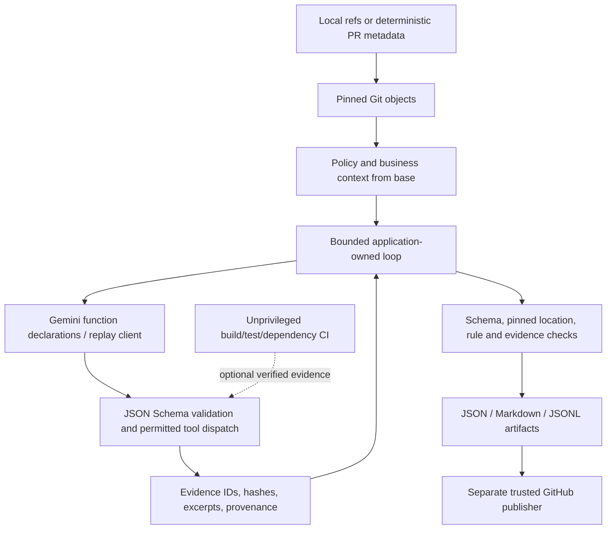

# Architecture

Undertow is one Java 25 CLI module packaged with Spring Boot 4.1.1. Spring owns application lifecycle and constructor injection at the CLI boundary; picocli owns command parsing and exit codes. The review engine remains plain Java, with JavaParser configured for Java 21 syntax analysis. Commands receive fresh option state for each invocation, and model clients are created only after loading pinned policy.

The order/payment demo is a separate Java 21 / Spring Boot 3.4.4 Maven module with PostgreSQL, Spring JDBC and Flyway. Its database integration tests use Testcontainers. See the [README tech stack](../README.md#tech-stack) for the libraries and tooling used by each part.

Spring reads only bundled `undertow.properties`, never working-directory `application.properties` or `config/` files. No web server or component scanning of reviewed projects is enabled. See the [migration decisions and validation](spring-java25-migration.md).

The model proposes investigations; the harness owns all permissions, budgets, termination and validation. Tools never build or run the reviewed application.

`ModelClient` separates native Gemini calling from authored replay. Gemini preserves returned content (including thought signatures) when continuing function calls; automatic SDK dispatch is disabled. Only transient 408/5xx errors are retried, with a bounded delay and call accounting. Authentication/quota failures stop visibly. A rejected final result receives one repair attempt.

`ToolRegistry` performs schema validation before dispatch. `GitRepository` pins full commit IDs once and reads blobs using fixed Git commands. It rejects traversal, absolute paths, control characters and symlink/nonregular blobs. JavaParser returns syntactic references with explicit unresolved receiver/overload/classpath status. Version 1 does not provide semantic symbol solving, JAR API comparison or Gradle/multi-module analysis.

`MavenInventory` compares direct literal POM inputs by default and labels parent/BOM/profile/transitive resolution unavailable. Optional hash-checked dependency-tree JSON for both snapshots provides direct/transitive paths and resolved versions. No Maven invocation occurs inside a tool.

`ReviewValidator` rejects unknown/duplicate fields, invalid enums, bogus locations, unknown rules/evidence, missing diff/source-range evidence, unsupported critical certainty, migration findings without retrieved documents and agent claims of executed tests. Evidence validation establishes traceability; it cannot automatically prove every semantic conclusion true. Human review and held-out evaluation remain necessary.

The loop accounts for actual provider usage where returned and conservative character estimates otherwise, reserves output capacity, limits cumulative context and stops at the deadline. These are conservative application controls, not provider billing enforcement. Output is complete/partial/failed/skipped; unresolved or excluded coverage cannot produce a clean-looking empty report.

No durable source cache or cross-repository memory is implemented. Each run produces a replayable evidence bundle. Replaying authored responses validates harness behavior, not future live model conclusions.
