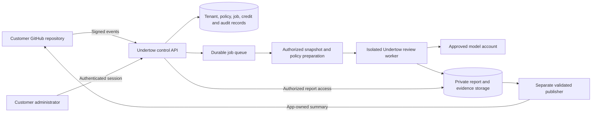

# Undertow Phase 3 — Centralized Review Service

Date: October 6, 2026  
Status: Draft for product and implementation review  
Product objective: Let customers receive evidence-backed PR reviews using their own rules while Undertow operates the engine, credentials, execution, and usage accounting centrally.  
Initial platform: GitHub.com. Initial analysis scope: the verified Phase 2 Java scope.

This document defines proposed behavior, not delivered capabilities. It supplements the [Phase 2 PRD](phase2-prd.md), [delivery status](phase2-status.md), and [report contract](phase2-report-contract.md). All configuration names, service endpoints, screens, and service records below are proposed unless explicitly described as existing.

## 1. Phase decision and dependencies

Put centralized hosting, customer authentication, tenant isolation, and credit management in **Phase 3**. Phase 2 establishes the review engine and its GitHub/report/evidence contracts; Phase 3 makes that engine a service customers can consume.

Phase 2 is not formally complete. Passing local and hosted CI, authored replays, and bot-summary tests does not satisfy its successful live-review, independent historical-PR evaluation, human-feedback, and operational acceptance gates. Planning and service development can proceed in parallel, but an external hosted pilot must use a versioned engine that passes the applicable Phase 2 P0 gates. An internal service demonstration using authored fixtures may precede those gates if it is clearly labeled.

Before external onboarding, consolidate the original Undertow workspace changes into reviewed commits and publish a pinned service-worker release. The original GitHub repository has not yet received those Phase 2 changes; the copied pilot is not the engine's release authority.

The earlier Phase 2 roadmap placed additional providers, multi-module analysis, and possible central administration in Phase 3. This proposal prioritizes the hosted product first. Additional providers and analysis expansion follow customer demand and do not delay the initial GitHub service. Existing `P3-01`/`P3-02`/`P3-03` roadmap placeholders retain their original meaning; this document uses `P3-SVC-*` IDs to avoid collisions.

## 2. Problem and product decision

Copying Undertow source into each customer repository creates multiple engine versions, exposes implementation details, and makes upgrades, model credentials, and usage control a customer responsibility. A distributed JAR or reusable action avoids source copying but still runs and distributes the engine in the customer's environment.

The default product is an **Undertow-operated hosted service**:

- Customer repositories contain application code, ordinary CI, and optional company policy files.
- A GitHub App connects selected repositories to the service.
- Undertow workers fetch authorized snapshots as data and run the existing bounded engine.
- The service publishes one app-owned PR summary and hosts access-controlled evidence.
- Customers manage enabled repositories, rule versions, usage limits, and service credits centrally.

No engine source, JAR, container image, model credential, or engine build step is required in a customer repository or CI job. A small remote API client can be offered later; it is not the review engine.

The repository currently contains an [MIT license](../LICENSE). Central execution is a deployment decision, not a change to that license. The product must not imply that hosting makes previously distributed engine code confidential. Visibility and licensing of future service components are separate owner decisions; changing the existing license is outside this PRD.

AI findings remain advisory. Tests and deterministic customer CI retain their existing merge policies. Automatic code changes, autonomous merges, and mandatory AI merge gating remain excluded.

## 3. Users and successful workflows

| User | Need | Successful outcome |
|---|---|---|
| Customer administrator | Connect repositories and control access/spend | Can enable selected repositories, select policy, cap usage, and revoke access |
| Developer / reviewer | Receive useful, current PR feedback | Can follow findings to code/evidence, request an authorized rerun, and understand incomplete results |
| Rule owner | Maintain company engineering and business rules | Can validate and activate a versioned package with unsafe/corrected examples |
| Billing viewer | Understand service consumption | Can see available/reserved/consumed credits and explain each debit |
| Undertow operator | Operate many customers safely | Can deploy one engine release, inspect failures, reconcile usage, and suspend a tenant |

### Customer onboarding

1. Sign in with GitHub and establish authorized membership in a customer organization.
2. Install the Undertow GitHub App on selected repositories and associate the verified installation with that organization.
3. Review source/model data flow and activate an approved model arrangement.
4. Choose repository policy files or a centrally stored rule package; validate the selected version.
5. Receive an operator-granted pilot credit allocation and configure repository/monthly limits.
6. Explicitly enable automatic reviews for selected repositories. Installation alone does not authorize model spending.
7. Open a supported PR and receive a summary with status, reviewed commit, evidence links, and usage.

### Everyday review

1. A verified PR event identifies an installed, enabled repository.
2. The service rechecks installation access, trigger policy, current source/target refs, applicable policy, and credit availability.
3. It creates or reuses an idempotent review record and atomically reserves the review budget.
4. A worker obtains pinned source and authorized CI evidence, resolves immutable policy, and runs the engine.
5. A separate publisher validates artifacts and current PR state before updating the app-owned summary.
6. Usage is settled or placed into reconciliation. Failed publication can be retried from retained artifacts without another model review.
7. A new commit or target/policy change makes the old result visibly outdated and produces a new eligible review according to policy.

### Customer repository example

```text
sample-order-service/
  pom.xml                         # Customer application dependencies
  src/main/java/...               # Application code
  src/test/java/...               # Application tests
  .github/workflows/ci.yml         # Ordinary application CI
  .undertow/rules.yaml             # Optional repository rule catalog
  .undertow/business-context.yaml  # Optional declared business invariants
  .undertow/guidelines.md          # Optional referenced policy text
  README.md                       # App installation and demo instructions
```

There is no Undertow engine dependency or privileged agent workflow in this example. These `.undertow/` policy paths are a proposed hosted interface; the current CLI policy paths remain supported independently.

## 4. Scope and priorities

P0 is required for the first external hosted pilot. P1 follows the P0 pilot and is not a launch dependency. Deferred work requires separate scope approval.

| ID | Priority | Deliverable |
|---|---|---|
| P3-SVC-01 | P0 | Central engine deployment and release authority |
| P3-SVC-02 | P0 | Customer organizations, authentication, authorization, and isolation |
| P3-SVC-03 | P0 | GitHub App installation, verified events, access lifecycle, and bot identity |
| P3-SVC-04 | P0 | Durable review jobs, deduplication, concurrency, and recovery |
| P3-SVC-05 | P0 | Repository or central rule packages and trusted policy resolution |
| P3-SVC-06 | P0 | Source acquisition, CI provenance, and isolated execution |
| P3-SVC-07 | P0 | Hosted reports, authorized evidence access, and PR publication |
| P3-SVC-08 | P0 | Service credits, reservations, metering, limits, and reconciliation |
| P3-SVC-09 | P0 | Centrally managed model access and credential custody |
| P3-SVC-10 | P0 | Minimal customer administration and operator controls |
| P3-SVC-11 | P0 | Retention, deletion, audit, monitoring, and incident controls |
| P3-SVC-12 | P0 | Customer-only sample repository and multi-customer acceptance pilot |
| P3-SVC-13 | P1 | Customer-supplied model credentials (BYOK) |
| P3-SVC-14 | P1 | Scoped service API tokens and a thin remote CLI/CI client |
| P3-SVC-15 | P1 | Automated top-ups/subscriptions through a payment provider |
| P3-SVC-16 | Deferred | GitLab/Bitbucket/custom-host adapters, ordered by customer demand |
| P3-SVC-17 | Deferred | Multi-module Maven, classpath analysis, Gradle, and additional languages |
| P3-SVC-18 | Deferred | Enterprise SSO/SCIM, regional/dedicated deployments, and customer-managed workers |

P0 provides an operational credit ledger with manual operator allocations. It does not require collecting card payments, managing tax invoices, or implementing a complete commercial billing platform. A large analytics dashboard, policy marketplace, organization inheritance hierarchy, automatic provider fallback, and autonomous fixes are also excluded.

## 5. Proposed service architecture



The existing engine remains the review worker; it is not copied or forked per customer. A control API handles identity, installations, configuration, scheduling, and accounting. Snapshot preparation holds repository read access. Review execution receives bounded read-only snapshots and its selected model credential. Publication receives narrowly scoped write access after artifact validation.

A relational database is the initial proposal for transactional tenant/job/credit state, with a durable queue and private artifact storage. A database-backed queue is acceptable for the pilot if it supports leases, durable retries, and recovery. A particular cloud provider, Kubernetes, and microservice decomposition are not product requirements. Start with one control application and separately isolated worker/publisher processes.

### Trust boundaries

| Boundary | Allowed authority | Excluded authority |
|---|---|---|
| Control API | Authenticated configuration, scheduling, ledger operations | Arbitrary code supplied by a repository |
| Snapshot preparation | Authorized repository/CI reads | Model calls and PR writes |
| Review worker | Approved model calls and bounded evidence tools | Shell/build/test execution, repository writes, publishing, global credentials |
| Publisher | Revalidate current PR state and update owned summary | Model inference or executing report content |
| Customer CI | Compile/test its application and create evidence | Service model keys, app private key, and Undertow engine distribution |

## 6. Functional requirements and acceptance criteria

### P3-SVC-01 — Central engine and releases

- Build the engine in the Undertow repository and deploy immutable, digest-pinned worker releases. Customer source cannot select executable engine artifacts.
- Record engine release/digest, model identity, prompt version/hash, analyzer versions, effective policy, and CI provenance for every review.
- Deploy improvements centrally. Use an operator-controlled canary rollout; do not silently change an in-flight review's engine or configuration.
- Keep the existing local CLI and report contract usable. Hosted execution adds a service boundary; it does not require rewriting the review loop or shipping it to customers.
- Review and publication retries use the original pinned artifacts/configuration. An engine/model/policy change produces a new review identity.

**Acceptance:** Two independent customer sample repositories receive reviews from the same deployed release without containing Undertow code, an engine JAR/image, or an engine build step. An upgrade and rollback are traceable by digest and preserve existing report readability.

### P3-SVC-02 — Identity, authorization, and isolation

- Represent customer organizations as explicit tenants. A user may belong to multiple tenants; switching organizations changes the authorized context, not just a UI filter.
- Use verified GitHub sign-in for the initial human identity. Check callback state, establish a bounded session, and validate account/installation association server-side.
- Associate a new installation only after verifying the user's authority to connect its account or receiving an invitation from an already authorized administrator. An installation ID, email domain, repository name, or URL parameter is insufficient proof.
- P0 roles are administrator, rule owner, reviewer, and billing viewer. Permissions may be combined. Operators use a separate service role.
- Derive tenant/repository access from verified identity and installation mappings. Caller-supplied IDs only select resources within that authority.
- Restrict source-bearing reports to users with both tenant access and current access to the corresponding GitHub repository. Billing access alone does not grant source access.
- Enforce tenant ownership across database queries, queue records, artifacts, caches, credentials, policy versions, feedback, and ledger entries.
- Revalidate GitHub access before privileged actions and artifact reads; routine cached authorization may be at most five minutes old. Logout, membership removal, and credential revocation invalidate service sessions/scopes as applicable.

| Role | Configuration/usage access | Review-data access |
|---|---|---|
| Administrator | Enable repositories, manage membership, select policy, set limits | Only repositories the user is also authorized to read |
| Rule owner | Validate/create rule versions for assigned repositories | Only authorized repositories |
| Reviewer | Request reruns, inspect findings, submit feedback | Only authorized repositories; reruns also require current write/maintain/admin authority |
| Billing viewer | View balances, allocations, and redacted usage | No source/evidence access through this role alone |
| Operator | Deploy, suspend, grant/reconcile credits, investigate operational metadata | Source access requires a separate time-bounded, audited support grant |

**Acceptance:** Tenant A cannot access tenant B's jobs, artifacts, policy, secrets, usage, or feedback through altered IDs, downloads, retries, caches, or queue payloads. Test users who belong to both tenants, a billing-only user, installation reassignment, and access removal during a job. All denied actions occur before model spending or data disclosure.

### P3-SVC-03 — GitHub App and event authorization

- Install on selected repositories; enabling reviews is an explicit customer administrator action.
- Verify webhook signatures over the original request bytes before parsing or admitting work. Persist delivery IDs for replay protection. Respond only after durable receipt or a retryable failure.
- Resolve installation and numeric repository identity against the server's tenant mapping and current GitHub access. PR fields cannot choose a new host or credential destination.
- Automatic review initially covers enabled, internal, non-draft PR opening, synchronization, reopening, and ready-for-review events on configured target branches. Preserve Phase 2 maintainer checks; forks/external contributions require an authorized maintainer request.
- Handle PR closure/draft transitions and installation suspension, removal, repository-selection changes, rename, and transfer. Reconfirm ownership on transfers; never carry a tenant association across accounts automatically.
- Source, target, merge base, and trusted policy commit remain distinct. Resolve the live target ref rather than assuming cached PR `base.sha` is current.
- A target-branch or active policy change invalidates affected summaries. Re-review only under configured automatic policy and budget; coalesce rapid events to the latest eligible snapshot.
- Configure publication ownership from the actual Undertow App's bot login and numeric identity. The hosted app must not impersonate `github-actions[bot]`.

Proposed minimum permission profile: repository metadata read, contents read, and pull requests write; actions read is needed when importing authorized Actions evidence. Extra administration, workflow-write, organization-wide, or Checks permissions require a concrete feature and a separate permission review. GitHub documents how permissions determine API/webhook/Git access. [Permission guidance](https://docs.github.com/en/apps/creating-github-apps/registering-a-github-app/choosing-permissions-for-a-github-app).

Use short-lived installation tokens scoped to the needed repositories and permissions for background automation. User access tokens govern user-initiated GitHub reads/actions; installation access is not proof of a user's access. Authorized service jobs publish as app automation and retain their initiating actor. [GitHub App authentication](https://docs.github.com/en/apps/creating-github-apps/authenticating-with-a-github-app/about-authentication-with-a-github-app), [installation tokens](https://docs.github.com/en/apps/creating-github-apps/authenticating-with-a-github-app/generating-an-installation-access-token-for-a-github-app), [token best practices](https://docs.github.com/en/apps/creating-github-apps/about-creating-github-apps/best-practices-for-creating-a-github-app).

**Acceptance:** Verify genuine, invalid, missing-signature, duplicated, reordered, and redelivered events; draft/fork policy; removed repositories; suspended installations; target advancement; rename/transfer; and revocation during fetch/publication. Invalid events create no model call or credit reservation. [Webhook signature contract](https://docs.github.com/en/webhooks/using-webhooks/validating-webhook-deliveries).

### P3-SVC-04 — Durable jobs and recovery

- Separate event delivery, logical review, execution attempt, and publication attempt identities.
- Deduplicate on delivery ID and on a review key containing tenant, provider/instance, stable repository identity, PR number, source/target/diff-base, effective policy, engine/model/prompt, and CI evidence identities.
- Provide one active publication owner per PR through a lease/fencing mechanism. A lost lease or older review cannot overwrite a newer summary.
- Queue work durably with bounded attempts, backoff, per-tenant fairness/concurrency, operator concurrency limits, cancellation, and dead-letter/reconciliation states.
- Retry transient transport/service errors only within the reserved budgets. Authentication, invalid policy, revoked access, daily quota, and exhausted credit require an actionable state; do not retry indefinitely.
- Respect bounded provider retry guidance without confusing temporary request limits with daily quota. No automatic paid/model/provider fallback.
- A worker crash or timeout does not prove that a provider call was unbilled. Handle uncertain usage through reconciliation rather than issuing another call blindly.
- Publishing an existing validated result does not re-run the model or debit another review charge.
- An intentional rerun uses a new request identity, live authorization, and a new reservation. API retries of that same rerun reuse its idempotency key and reservation.

**Acceptance:** Duplicate delivery, two schedulers, worker/publisher crashes, lease expiration, lost POST response, rapid force-push, and repeated rerun requests produce no unauthorized publication or duplicate customer debit. At-least-once job delivery must not be advertised as exactly-once external model execution.

### P3-SVC-05 — Customer rules and effective policy

- Each repository selects one policy source: repository files at the trusted target commit, or an explicitly activated immutable central package. P0 does not merge a hierarchy of customer/organization/repository rule packs.
- Central packages are versioned uploads of validated rule YAML, guideline text, and optional business context/reference fixtures. Draft validation and activation are separate operations, with owner and audit history.
- Repository rules, exceptions, and business context come from the trusted target snapshot. Head-side disabling, exceptions, or config changes cannot suppress the current PR review.
- Validate the existing v1/v2 migration semantics, references, scopes, examples, registered executors, unknown fields, dates, and exceptions. Rules remain inert data; they do not register shell/network tools.
- Central reference files resolve only within the immutable package. Repository references resolve only within pinned authorized objects. Mutable external rule downloads remain excluded.
- Host-controlled execution policy chooses credentials, model/provider, tool/host allowlists, supported scope, and maximum budgets. Customer rule files cannot choose environment-variable names, read service secrets, switch providers, increase service limits, or change tenant identity.
- Resolve customer limits under service caps and pin an effective policy hash before execution. Do not achieve this by silently rewriting customer Git objects or pretending a server override originated at a repository commit.
- Record both repository policy commit/package version and service execution-policy version. Activation affects subsequent jobs; in-flight jobs retain their snapshot or are explicitly cancelled.

**Acceptance:** Run unsafe/corrected tenant-isolation examples using both policy-source modes without engine changes. Reject head-side suppression, arbitrary model/key-env selection, malformed packages, expired exceptions, remote references, and cross-tenant version selection. Reproduce the effective policy from recorded immutable versions/hashes.

### P3-SVC-06 — Source, CI evidence, and worker isolation

- Derive fetch destinations from registered GitHub.com repository identity. Private fetch credentials remain separate from model/publication credentials and absent from URLs, persisted Git configuration, logs, and artifacts.
- Fetch pinned objects into job-isolated storage; compute the actual merge base. Missing/bounded history produces an explicit failure rather than target-tip substitution.
- Never check out or execute customer builds, wrappers, plugins, scripts, or generated tests inside the review worker. Existing read-only tools and support limits remain authoritative.
- Import CI only from registered workflows and verified API/run/artifact provenance. Bind evidence to the actual tested commit; a merge-ref build is not automatically evidence for the reviewed source-head SHA.
- Preserve content hashes, origin receipts, XML/JSON/archive limits, and missing-artifact states. Uploaded files or hashes alone do not establish CI execution authenticity.
- Keep executed tests/analyzer findings distinct from model-proposed regression tests. Unsupported files and missing CI/classpath evidence remain visible.
- Prevent cross-job context, source, parser-cache, and credential reuse. Tenant/repository/commit/analyzer identity must be part of any permitted cache key.

**Acceptance:** Reject wrong repository/SHA/run, modified/missing artifact, unsafe archive/XML, arbitrary URL, unsupported scope, and cache collisions. A customer build that tries to read service credentials cannot reach them; prompt-injection fixtures cannot grant tools or publication authority.

### P3-SVC-07 — Reports and publication

- Preserve engine report/evidence validation and v1/v2 compatibility. Add a separately versioned service envelope for tenant/job/admission/metering metadata; do not silently reinterpret engine fields.
- Keep job outcome, review outcome, publication outcome, and metering outcome separate. A successful HTTP request or finished queue job is not a complete AI review.
- If admission prevents execution, expose `not run` with a reason and no invented engine report. Insufficient credits, disabled repository, or invalid policy never becomes a clean review.
- The PR first screen shows review/service status, reviewed SHA, important finding count, major gaps/failure reason, and a detailed-report link. Source links remain pinned; evidence pages require authorization.
- Use the existing canonical finding fingerprints and safe pending/stale/recovery protocol. Preserve source/target checks before and after writes. Incomplete output cannot establish resolution of previously reported risks.
- Artifacts are private and downloaded through an authorization-checked service endpoint. Possessing a review ID or PR URL is insufficient access. A private PR must never point to a public evidence page.
- Record publication receipts and retries separately; permission loss or API errors preserve artifacts. Customer tests and merges do not depend on service availability.
- Capture append-only human feedback against tenant/review/finding identity. Corrections are new entries; model scoring is not human adjudication.

**Acceptance:** Verify one owned summary, repeat updates, wrong bot identity, stale/closed PRs, revoked permission, network ambiguity, partial zero-findings, and denied artifact access. A customer can reach evidence for two important findings and distinguish authored replay from live output and executed tests from proposed tests.

### P3-SVC-08 — Credits, budgets, and metering

P0 credits are internal service-consumption units assigned by an operator. Prices, included allocations, credit conversion, and expiry policy must be approved before chargeable onboarding; this PRD does not specify current model prices or a monetary balance.

- Use an append-only ledger with grants, reservations, settlements, releases, expiry, and audited adjustments. Corrections append compensating entries; never edit prior consumption silently.
- Store integer/fixed-point units, pricing version, review/attempt identity, reason, and actor. Available balance equals eligible grants less settled use and active reservations; expired grants cannot fund new work.
- Atomically reserve the worst-case approved review charge before the first model call. Concurrent jobs must not overspend the customer's allocation.
- Enforce per-review, repository, billing-period, tenant-concurrency, and global provider/service limits. Period resets are explicit accounting events, not deletion of ledger history.
- Pin the tariff and effective token/call/time caps. Show estimated maximum reservation and actual settlement separately; a reservation is not a promise of exact provider billing.
- Proposed pilot charging rule: charge verified billable model usage under the pinned tariff even when a result is partial; add no separate completion/publication fee. Disclose this before enabling automatic reviews. Failure before a model call, duplicate delivery, and publication-only retries incur no inference debit.
- Automatic service retry usage stays within the original disclosed reservation and is accounted once. A deliberate new review may consume credits again; retrying its API request may not.
- Missing/uncertain provider usage enters `reconciliation_required`; do not record it as zero/free or charge an invented amount. Hold the remaining reservation for at most 24 hours, then settle verified usage or record an explicit service-absorbed release with an operator audit reason.
- Provider invoice discrepancies remain service operational cost unless a verified customer debit follows the disclosed tariff. Metering must not promise stronger provider spending caps than the engine/API can enforce.
- Report tokens, model calls, provider/model, latency, known provider cost when priced, credits settled/reserved, and failure reason. Unknown pricing/usage remains unknown.
- Replenishment makes still-eligible blocked jobs available only under existing opt-in and fresh snapshot/access checks. Never run every obsolete queued PR version after a top-up.

**Acceptance:** Parallel jobs, duplicate events, manual reruns, worker crashes before/after inference, partial results, usage-less responses, price changes, expired grants, refunds/adjustments, and publication retries yield explainable balances and at most one settlement per logical review. Test the accounting invariant independently from model correctness.

### P3-SVC-09 — Model accounts and credentials

- P0 uses an Undertow-managed, explicitly approved model account; retain the current provider adapter rather than requiring a new provider for hosting.
- Route each admitted review through a server-selected account and model. Enforce provider-account limits as well as customer credits; ample service credits do not imply available provider quota.
- Store app keys, webhook secrets, user tokens, and model keys in appropriate protected storage. Inject only the credential needed by each process; never expose service-wide credentials to a review worker.
- Credentials are absent from rule files, repository secrets required by the integration, API responses, reports, traces, support exports, and browser/client bundles. Credential configuration exposes status and rotation controls, not plaintext retrieval.
- On authentication/quota/access failure, retain an actionable outcome and its usage state. No credential reuse across tenants or silent alternate account/provider is permitted.
- Approve provider processing/retention settings before proprietary source is submitted. A source-free preflight confirms access, not capacity, privacy suitability, or review quality.

The managed account for proprietary source must use a verified arrangement appropriate to that data. Google's current Gemini terms distinguish unpaid and paid processing and describe limited logging for paid services; Undertow must not claim universal zero retention or treat a free demo account as automatically suitable for customer secrets. [Gemini data terms](https://ai.google.dev/gemini-api/terms), [logging controls](https://ai.google.dev/gemini-api/docs/logs-policy).

**Acceptance:** Credential redaction and rotation tests pass; repository policy cannot select another secret/account. Authentication, rate limit, daily quota, timeout, and invalid-output cases retain explicit states. Revoking one account does not fall back to another tenant's account.

### P3-SVC-10 — Minimal administration

Provide a small hosted interface with GitHub sign-in, organization selection, installation/repository status, review opt-in, policy validation/activation, budget settings, credit balances/usage, review history/detail, and feedback. Source-free billing views must not expose paths or evidence.

Operator controls include tenant suspension, manual credit grant/adjustment, reconciliation, engine rollout, service kill switch, and sanitized operational diagnostics. Each privileged action records its actor and reason. Support impersonation is not a default feature.

**Acceptance:** An administrator completes installation, policy selection, limit configuration, and first sample review without copying the engine or adding a model key to the application repo. Billing-only and reviewer roles cannot perform administrative actions.

### P3-SVC-11 — Retention, deletion, and operations

- Show and record customer authorization for source processing, approved provider/account arrangement, retention, and automatic spending before activation.
- Encrypt sensitive stored data and transport; keep raw source/prompt logging disabled by default. Operational logs use tenant/job IDs and sanitized causes.
- Proposed pilot defaults: clean transient source/workspaces within one hour of terminal completion; retain source-bearing reports/evidence for seven days; retain source-free operational/audit/ledger metadata for 90 days. These are product defaults requiring approval before onboarding, not regulatory retention advice.
- Expiry/deletion must cover artifacts, snapshots, temporary files, caches, and exported diagnostic bundles. Document backup expiry and provider retention separately; do not promise deletion from systems Undertow does not control.
- Installation removal stops new access, cancels pending jobs, and invalidates active capabilities where possible. Tenant deletion immediately disables access and removes active source-bearing data within 24 hours; disclose any retained source-free records and backup window.
- Maintain per-tenant and global circuit breakers, rate controls, queue-health alerts, error/latency/usage metrics, backups, restoration procedures, and a provider-outage runbook.
- Audit access-sensitive changes, grants/settlements, policy activation, reruns, publication, and support grants without storing raw credentials/source in audit entries.

**Acceptance:** Verify retention expiry, tenant deletion, installation revocation during execution, restored-backup access controls, worker workspace cleanup, noisy-tenant isolation, and an operator kill switch. The documented restore drill reproduces credit/job state without duplicate debits or publications.

### P3-SVC-12 — Customer-only demonstration and pilot

- Create a dedicated sample customer application with rules and ordinary CI, using the layout in Section 3. It consumes the deployed service through an installed App.
- Demonstrate payment unsafe/corrected, company tenant-isolation unsafe/corrected, benign change, unsupported input, missing CI, unavailable model, insufficient credit, and revoked access.
- Use at least two tenant identities and two independently authorized installations with private repositories to exercise isolation; two repositories in one installation do not establish tenant isolation.
- Preserve the existing copied pilot as explicitly labeled development evidence, or replace its current contents through ordinary forward commits. Do not delete its history or describe earlier copied-engine runs as hosted customer integrations.
- Compare the same frozen inputs through the local engine and hosted worker. Match policy/evidence validation and deterministic replay results; measure live-model variability separately.
- Report actual onboarding time, queue/worker/publication latency, usage, failure denominators, credit reconciliation, and human feedback. Authored customer fixtures do not replace the Phase 2 historical-PR/human-label population.

**Acceptance:** A newly authorized administrator connects a customer-only sample and obtains a live result through the central service. Two tenants remain isolated; engine upgrades require no customer engine change; risky/corrected and failure flows are traceable to snapshots and receipts. Replay demonstrations remain labeled and cannot substitute for successful live acceptance.

## 7. Optional commercial and integration extensions

### P3-SVC-13 — BYOK

Allow a customer administrator to store and rotate a tenant-specific supported model key through a protected interface. Display only status/metadata; never return the key. Probe with no source, verify the approved data arrangement, and route only that tenant's jobs through it.

Provider usage is billed by the provider to that customer account. Any Undertow platform charge must be separately defined; managed-inference credits must not also charge that same provider usage. No silent fallback to a managed account on BYOK failure. BYOK does not by itself provide tenant isolation or privacy approval.

**Acceptance:** Verify routing, redaction, rotation, revocation, usage separation, and no cross-tenant key use. BYOK is optional for P0 completion.

### P3-SVC-14 — API/remote client

Offer revocable, expiring, scoped service tokens for authorized CI/CLI callers. Scope to tenant, selected repositories, and explicit operations. Store verification material securely and show a newly created token only once. A thin client submits registered PR/ref identifiers and polls/downloads authorized results; it does not contain the engine.

Direct patch/archive uploads require a separate provenance and policy-authority design; an API token does not make uploaded CI output trusted. Local/offline engine operation remains a different deployment option.

**Acceptance:** Unauthorized repository IDs, arbitrary clone URLs, expired/revoked tokens, cross-tenant retries, and missing idempotency keys are rejected. One logical API request yields one reservation/review despite transport retries.

### P3-SVC-15 — Payments

Integrate a payment provider only after approving pricing, commercial terms, and the operating model. Use hosted checkout and verified payment events rather than storing card data. Map a uniquely verified successful payment/subscription allocation to one ledger grant; handle redelivery, refunds, disputes, and cancellation with compensating records.

Subscription limits, invoice/tax handling, refund policy, and negative-balance behavior need an explicit commercial specification. Manual pilot allocations remain sufficient for P0.

## 8. Proposed service contracts and data records

### API surface

| Surface | Purpose | Authority |
|---|---|---|
| `POST /v1/webhooks/github` | Receive a durable verified event | Webhook signature plus installation/repository mapping |
| `GET /v1/repositories` | List usable connected repositories | Authenticated membership intersected with GitHub access |
| `PATCH /v1/repositories/{id}/settings` | Enable reviews, choose policy, set limits | Authorized administrator; current installation access |
| `POST /v1/rule-packages` / activation operation | Validate/version central policy and explicitly activate it | Assigned rule owner/admin; immutable package ownership |
| `POST /v1/repositories/{id}/pull-requests/{number}/reviews` | Request an intentional rerun | Authorized reviewer/maintainer; idempotency key; budget reservation |
| `GET /v1/reviews/{id}` / artifact download | Inspect outcomes and evidence | Tenant membership and current repository read access |
| `GET /v1/usage` / `GET /v1/credits` | Inspect accounting | Authorized billing role; source-free fields |
| `POST /v1/reviews/{id}/feedback` | Append human assessment/correction | Authorized reviewer; finding/run identity |
| Operator-only grant/reconciliation operations | Allocate credits and resolve uncertain use | Operator role, reason, idempotency, audit record |

The path names are illustrative. API authentication, authorization, versioning, request limits, idempotency, and error contracts must be specified before implementation. Browser sessions serve the P0 customer UI; machine service tokens are P1. Identical idempotency keys with different payloads return a conflict and cannot create a second debit.

### Minimum records

| Record | Required identity and purpose |
|---|---|
| Tenant / membership | Tenant ID, verified external account IDs, user ID, roles, lifecycle |
| Installation / repository | Provider/instance, app/installation ID, stable repository ID, tenant mapping, access/opt-in state |
| Rule package / activation | Owning tenant, immutable version/hash, source, references, validator version, actor, activation history |
| Event / review / attempt | Delivery/request ID, dedupe key, tenant/repo/PR, snapshot, configuration identity, lease, stage, sanitized outcome |
| Artifact / publication | Tenant/review ownership, content hashes, schemas, retention, bot comment ID, fingerprint map, publication receipt |
| Usage / credit ledger | Pricing version, verified/uncertain units, provider/account reference, grant/reservation/settlement/release, review ID |
| Credential reference | Tenant/account association, protected-secret reference, status/rotation; no plaintext in ordinary records |
| Feedback / audit | Actor, tenant/review/finding, assessment/action/reason, append-only history |

### Outcome separation

| Layer | Example states | Meaning |
|---|---|---|
| Admission | accepted / rejected | Access, policy, capacity, and credit checks; rejection has a specific reason |
| Job | queued / preparing / running / publishing / finished / failed / cancelled | Service orchestration, not review quality |
| Review | complete / partial / failed / skipped; absent if never run | Existing engine contract within its declared scope |
| Publication | published / stale / failed / not_requested | Existing separate publication contract |
| Metering | reserved / settled / released / reconciliation_required | Accounting outcome, independent of finding correctness |

The service envelope has its own schema version and binds engine artifact hashes, all snapshot fields, effective policy identities, service job/tenant identity, execution mode, and metering/publication receipts. A billing update does not alter historical engine findings. Raw credentials never form part of an envelope, identifier, fingerprint, or cache key.

## 9. Data handling and consent

Centralization means source flows from an authorized GitHub repository to Undertow workers and, for live inference, to the selected model account. Customer administrators must understand this before enabling reviews. File-based rules do not prevent source transfer, and BYOK does not mean the review runs locally.

Onboarding states the supported provider/model arrangement, information submitted, relevant retention controls, artifact audience, service region, and usage policy. Provider terms/settings must be checked for the specific account and customer jurisdiction before proprietary data is enabled. No customer source may be reused for cross-customer training, demonstrations, or evaluation without separate explicit authorization.

Customers requiring source to remain in their own environment need a separately scoped dedicated/customer-managed deployment. That option is not silently substituted for the hosted architecture and is not part of P0.

## 10. Acceptance matrix and pilot targets

Targets below are proposed acceptance thresholds, not current performance claims. Keep service-operation metrics separate from engine quality, including Phase 2's live/human measurement requirements.

| Area | Pilot evidence | Exit target |
|---|---|---|
| Customer integration | Two customer-only apps in two tenant/install contexts | No engine code/artifact/build step or model secret required in customer repos |
| Authorization/isolation | Positive and adversarial membership/repo/artifact/cache/credential tests | Zero unauthorized disclosure, execution, publication, or credit access |
| Event/job recovery | At least 100 controlled duplicate/reordered deliveries and crash/retry exercises | One logical admitted review/reservation and no duplicate debit/summary |
| Accounting | Concurrent reservation/settlement tests plus every pilot review reconciled | Ledger invariants hold; no unexplained balances or unresolved items past the 24-hour reconciliation limit |
| Live workflow | At least 20 eligible supported live PR reviews, including risky/corrected and benign flows | At least 90% complete engine reviews; partial/failure/service-access outcomes remain in the denominator |
| Publication | Every validated eligible result plus stale/closed/access-loss tests | No falsely current result, foreign-comment update, or duplicate summary; no inference re-run for publication-only recovery |
| Latency | Eligible reviews with at most 20 files / 500 changed lines | p95 queue-to-worker start at most 60 seconds; worker start-to-artifacts at most five minutes; publication duration reported separately |
| Onboarding | Two authorized new administrators with access/dependencies ready | First live customer-only report within 30 minutes; all failure steps actionable |
| Retention/revocation | Expiry, removal, deletion, and restoration drills | Meet Section 6 deadlines; no reactivation of revoked access after restore |
| Engine equivalence | Frozen replay inputs through local and hosted execution | Same deterministic validations/grounded replay findings; live variation measured separately |
| Operating cost | Per-tenant actual usage, holds, price versions, and service cost | Within an owner-approved pilot budget; unknown usage/pricing cannot count as zero |

Report eligible/supported counts, excluded reasons, failures, model/engine/policy versions, and uncertainty. Twenty hosted reviews establish service exercise coverage; they do not replace Phase 2's 30 historical PRs, two repositories, ten benign controls, twenty independently labeled high-risk defects, and two-reviewer adjudication requirements.

Customer-only authored fixtures may satisfy integration and failure demonstrations. They cannot establish independently measured model precision, recall, or commercial readiness. No result quality improvement is assumed solely from hosting.

## 11. Delivery sequence and release gates

| Milestone | Deliverable | Gate |
|---|---|---|
| M0 — Engine release baseline | Consolidate/review original Phase 2 changes, complete required evaluation, pin worker release and migration contract | External pilot blocked until applicable Phase 2 P0 gates pass; internal authored demonstrations allowed |
| M1 — Hosted foundation | Tenant/auth model, GitHub App, signed event intake, durable jobs, isolated central worker, private artifacts | Two internal tenant contexts; unauthorized work rejected before inference |
| M2 — Rules and usage | Both immutable policy-source modes, service execution caps, managed model account, credit reservation/settlement/reconciliation | Concurrent accounting and rule-authority tests pass; approved tariff/data arrangement/budgets |
| M3 — Customer experience | Minimal UI, current app-owned summaries, authenticated evidence, feedback, access/retention controls | Onboarding and source-bearing artifact authorization demonstrated |
| M4 — Customer-only pilot | Dedicated sample apps, upgrade/rollback, risky/corrected and failure flows, live operational measurements | All P0 acceptance criteria and Section 10 targets pass, with remaining limitations published |
| M5 — Commercial extensions | BYOK, thin API client, optional payments; later provider/analysis expansion | Separate scoped acceptance; does not postpone P0 |

No calendar/effort estimate is committed. Size work after selecting hosting, provider capacity, customer data arrangement, and operator staffing. More Git providers, multi-module analysis, or billing integration must not displace tenant isolation, accounting correctness, or existing review/evidence safety.

## 12. Migration, rollout, and rollback

1. Preserve the original engine, tests, policy/report compatibility, and existing pilot evidence; make its release lineage explicit.
2. Add service orchestration around the engine and a host-authoritative policy resolver. Do not maintain a per-customer engine fork.
3. Build new customer-only samples instead of treating the copied-engine pilot as the hosted product demonstration.
4. Verify the service in internal authored/replay mode, then an authorized live canary tenant after engine/data/budget gates.
5. Enable automatic reviews repository by repository. Disable the old customer-run agent workflow when migrating that repository, while retaining ordinary application CI and local CLI use where desired.
6. Record provider/app migration and canonical identity mappings. Do not blindly reuse GitHub Actions bot comments as App-owned comments; make legacy summaries visibly superseded through an authorized transition.

Rollback disables new admissions at global, tenant, or repository scope, drains/cancels queued work with credit holds handled explicitly, and restores a prior pinned worker release for subsequent authorized jobs. Preserve report/publication/ledger/audit records; a database rollback must not erase settlements or reissue spent credits. App access can be suspended/revoked independently of ordinary customer CI.

## 13. Decisions required before external pilot

| Decision | Proposed starting point | Owner / deadline |
|---|---|---|
| Product distribution and service licensing | Hosted engine; retain existing MIT history/CLI; decide terms/visibility of new service components separately | Product owner before service release |
| Hosting and worker isolation | One control app, transactional database, durable queue, private storage, isolated workers | Engineering before M1 implementation |
| Customer account model | One verified GitHub account/installation belongs to one active tenant initially; many repos/users per tenant | Product/engineering before onboarding |
| Model/privacy arrangement | Managed supported account with verified customer-data terms, quota and retention; no fallback | Product/operator before live customer source |
| Credit tariff and failure charges | Operator-granted usage credits; verified usage charged within disclosed reservations; uncertain usage reconciled | Product owner before M2 charging |
| Spending and capacity | Explicit per-review/tenant/global budgets and concurrency; pilot allocation approved | Product/operator before enabling automatic inference |
| Data region/retention/backups | Proposed one-hour workspace / seven-day artifacts / 90-day source-free records; documented backup expiry | Product/operator before external onboarding |
| Actual customer requirements | GitHub.com and current Java support; bring another provider/deployment forward only for validated need | Product owner before M4 scope freeze |
| Payments / BYOK / remote tokens | P1; managed-credit P0 pilot first | Product owner after P0 evidence |

These decisions authorize concrete operating parameters; they are not reasons to postpone preparing the PRD or internal service contracts.

## 14. Definition of done

Phase 3 P0 is complete when customers can connect selected repositories, choose versioned company rules, control access and credits, and receive validated current reviews from a centrally deployed engine without embedding that engine in their repositories. Two tenant contexts demonstrate isolation, recovery and accounting correctness, authorized evidence access, lifecycle/retention controls, and a customer-only live workflow. The Phase 2 engine acceptance gates and Section 10 service gates both pass.

Release documentation covers onboarding, permissions, data flow, supported scope, policy activation, usage/failure charges, retries, partial outcomes, credential/access revocation, feedback, retention/deletion, incident response, and rollback. BYOK, payment automation, new providers, enterprise deployment, and wider language/build support are advertised only after their own acceptance criteria pass.

## 15. References and implementation anchors

Existing repository anchors: [Phase 2 PRD](phase2-prd.md), [Phase 2 status](phase2-status.md), [v2 report contract](phase2-report-contract.md), [review engine](../src/main/java/dev/undertow/harness/Reviewer.java), [rule catalog](../src/main/java/dev/undertow/policy/RuleCatalog.java), [provider contracts](../src/main/java/dev/undertow/changes/ChangeAdapters.java), [GitHub adapter](../src/main/java/dev/undertow/github/GitHubClient.java), [CI importer](../scripts/import-ci.py), [pilot measurement](../scripts/pilot-measure.py), and [license](../LICENSE).

Platform guidance was checked against the official sources linked in the relevant requirements on October 6, 2026. Reverify API permissions, authentication behavior, model account capacity, and provider data terms when implementing and onboarding. This document does not register an App, provision infrastructure, change licensing, enable billing, publish code, or modify the test repository.
